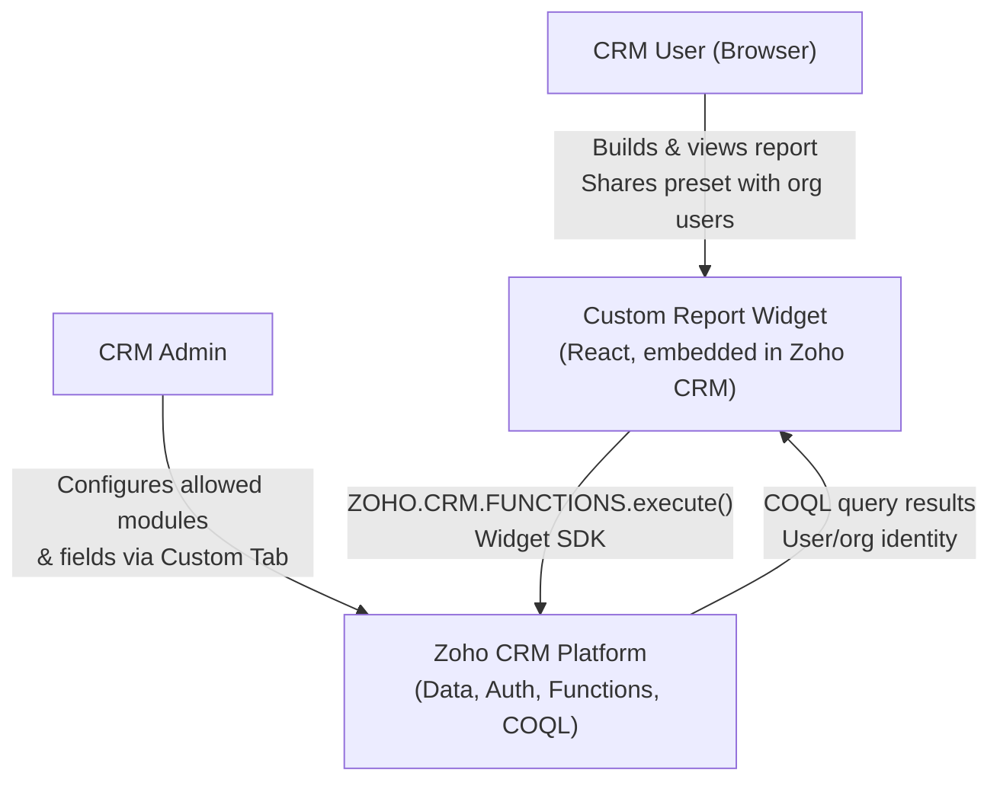
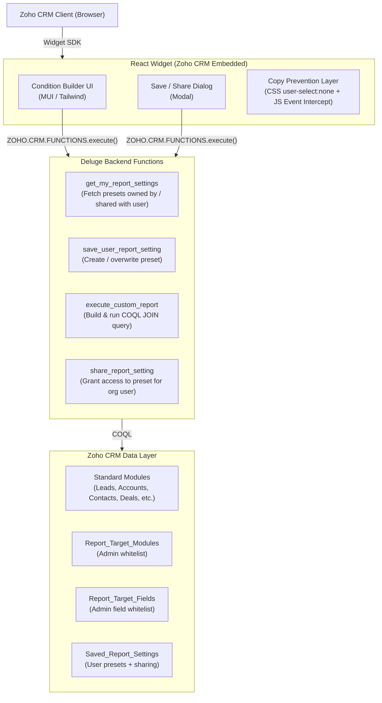

# HLD-CUSTOMREPORT-001: Zoho CRM Custom Report Widget

**Date:** 2026-06-03
**Status:** Draft
**Author:** Vivek
**Reviewers:** —
**Project:** CRM Custom Report
**PRD Reference:** `/home/vivek/project/INTERNAL/custom_report/requirement/customreport_functionality_req_new_en.md`
**ADR References:** —

---

## 0. Requirements Summary

Derived from PRD Section 0. Full detail in the PRD reference above.

### Must Requirements

| Requirement | Approach |
| :--- | :--- |
| **Casual copy prevention** (right-click, Ctrl+C, and text selection are intercepted; DevTools and screenshots cannot be blocked) | CSS `user-select: none` globally in React. JavaScript intercepts `copy` (Ctrl+C) and `contextmenu` (right-click) events to block clipboard transfer. For high-sensitivity data, exclude fields from the `Report_Target_Fields` admin whitelist — that is the only effective access control. |
| **Favorites save feature** (reuse of filters, field order, etc.) | Serialize selected source table, field list (ordered), filter conditions, and aggregation/grouping settings as a single JSON string stored in `Saved_Report_Settings.Config_JSON`. |
| **Only the creator can reuse and edit** (others cannot edit or delete) | Identify user via Deluge `zoho.loginuser` at save time and set as record `Owner`. Configure `Saved_Report_Settings` custom tab with Zoho CRM Sharing Rules = **Private** to enforce system-level access control. |
| **Admin-controlled master** (target tabs, fields, aggregation rules) | Admin-only master tabs (`Report_Target_Modules` / `Report_Target_Fields`). Widget loads this master on startup and maps only permitted objects, fields, and aggregation types to dropdowns. |

### Want Requirements

| Requirement | Approach |
| :--- | :--- |
| **JOIN retrieval via lookup references** (related tab access via COQL) | Add `Is_Lookup` attribute to `Report_Target_Fields`. When selected, use COQL dot notation (e.g., `SELECT Account_Name.Account_Name FROM Leads`) to dynamically fetch parent record fields — no explicit JOIN ON clause required. |
| **Sharing with users other than the creator** | Owner-explicit sharing: store share-target user/role in the preset and add `OR share_target = logged_in_user` to retrieval WHERE clause. Optional: issue a sharing URL parameter. |
| **API credit consumption consideration** | Consolidate all data access to `zoho.crm.coql`. Fetch up to 2,000 records per backend call (COQL hard limit) and hold the full chunk in React State. UI paginates within the in-memory chunk at 100 records per page — no backend call for page turns within the same chunk. A new backend call fires only when the user navigates past the last record in the current chunk. Execute backend call only when "Generate Report" is explicitly pressed (on-demand execution — no auto-refresh). |

---

## 1. Problem Statement

Zoho CRM's built-in report functionality does not support dynamic, user-configurable multi-module join queries with fine-grained access control. Users cannot build ad-hoc cross-module reports without CRM admin involvement, and no mechanism exists to share saved report presets with other users in the same organization. This feature delivers a self-service report builder embedded directly inside Zoho CRM as a widget.

---

## 2. Goals & Non-Goals

### Goals

- Allow end users to select fields across multiple Zoho CRM modules and execute cross-module COQL JOIN queries.
- Enforce admin-defined whitelists for which modules and fields users may query.
- Allow users to save, overwrite, and load named report presets.
- Allow users to share saved report presets with other users in the same Zoho org (explicit user/role sharing or URL parameter sharing).
- Prevent unauthorized data extraction: no file download or clipboard copy of report results.
- Stay within Zoho COQL credit limits by enforcing pagination, on-demand execution, and React State caching.
- Support COQL dot notation for Lookup field access across related modules (`SELECT Lookup.Field FROM Module`).

### Non-Goals

- Exporting or downloading report results to CSV, Excel, or any file format.
- Sending report results outside the Zoho org (email, webhook, external storage).
- Custom chart or visualization beyond tabular display.
- Real-time or scheduled (cron) report execution.
- Admin UI for managing `Report_Target_Modules` and `Report_Target_Fields` (assumed managed directly in Zoho CRM custom tab).

---

## 3. System Context Diagram (C4 L1)

---

## 4. Container Diagram (C4 L2)

---

## 5. Data Flow

### 5.1 Report Execution Flow

1. User selects primary module and related modules from the admin-whitelisted dropdown.
2. User picks fields from each module, optionally sets filter conditions and aggregation rules.
3. Report conditions are held in React State. **No backend call is made until the user explicitly clicks "Generate Report"** (on-demand execution).
4. Widget calls `execute_custom_report` Deluge function via `ZOHO.CRM.FUNCTIONS.execute()`.
5. Deluge validates that all requested modules and fields exist in `Report_Target_Modules` / `Report_Target_Fields`.
6. For Lookup-type fields, Deluge builds COQL using dot notation (e.g., `SELECT Account_Name.Account_Name FROM Leads`) rather than an explicit JOIN ON clause.
7. COQL is executed via `zoho.crm.coql`; up to 2,000 records are returned in a single call (one chunk).
8. The full chunk is stored in React State (`reportData`). The UI displays 100 records per page by slicing the in-memory array — no backend call for page turns within the same chunk. When the user navigates past the last record in the chunk, a new backend call fetches the next 2,000-record chunk (`OFFSET` advanced by 2,000).
9. Widget renders results in a read-only table with copy prevention active.

### 5.2 Preset Save / Share Flow

1. User clicks Save; Save Dialog prompts for a preset name.
2. Widget calls `save_user_report_setting`; Deluge writes to `Saved_Report_Settings` with the current user as Owner.
3. To share, user selects one or more Zoho org users; widget calls `share_report_setting`.
4. Deluge stores share relationships — either as a shared-users JSON field or a separate join table — while preserving the original Owner.
5. Recipients see the shared preset in their preset list when they next load the widget.

---

## 6. Integration Points

| External System | Purpose | Auth Method | Notes |
|---|---|---|---|
| Zoho CRM Widget SDK | Embed widget in CRM page, get current user context | Zoho Widget OAuth (automatic via SDK) | `ZOHO.CRM.CONFIG.getCurrentUser()` |
| Zoho CRM Functions (Deluge) | Execute server-side logic | Invoked via `ZOHO.CRM.FUNCTIONS.execute()` within widget context | No additional auth token needed |
| Zoho CRM COQL | Query CRM data; Lookup field access via dot notation | Deluge `zoho.crm.coql` (preferred; up to 2,000 records per backend call; UI paginates within the in-memory chunk) | Subject to Zoho API credit limits |
| Zoho CRM Custom Tabs | Persist admin config & user presets | CRM standard record read/write in Deluge | `Report_Target_Modules`, `Report_Target_Fields`, `Saved_Report_Settings` |

---

## 7. Security Boundary

| Concern | Approach |
|---|---|
| Authentication | Zoho CRM session — widget SDK provides current user identity; no separate auth needed |
| Authorization | Deluge validates requested fields/modules against admin whitelist before building COQL |
| Report sharing scope | Sharing restricted to users within the same Zoho CRM org; cross-org sharing blocked |
| Data in transit | All calls occur within Zoho platform over HTTPS; no data leaves Zoho infrastructure |
| Data at rest | Stored in Zoho CRM Custom Tabs; subject to Zoho's platform encryption |
| **Download prevention** | No export endpoint exposed. Frontend has no download button. `Blob` / `URL.createObjectURL` never called. Backend returns JSON only — no file stream. |
| **Casual copy prevention** | `user-select: none` on result table. `contextmenu` and `copy` events are intercepted and cancelled in the widget JS. DevTools and screenshots cannot be prevented — exclude sensitive fields from the `Report_Target_Fields` whitelist for true access control. |
| **Preset access (platform level)** | `Saved_Report_Settings` custom tab configured with Zoho CRM Sharing Rules = **Private**. Platform enforces that only the Owner can view or edit the record. Shared access granted explicitly by the Owner. |
| PII fields | Report results may contain PII (names, emails) from CRM records — display only, never persisted to browser storage |

### Threat Model

| Threat | Mitigation |
|---|---|
| User queries a module not in the admin whitelist | Deluge validates every requested module API name against `Report_Target_Modules` before executing COQL. Query is rejected if any module is absent. |
| User crafts a malicious COQL string via the frontend payload | Deluge builds the COQL programmatically from validated field/module names — no raw user-supplied COQL string is ever executed. |
| User copies report data via browser clipboard (Ctrl+C) | `copy` event listener calls `event.preventDefault()`. `user-select: none` prevents drag-selection. Right-click context menu is suppressed. Note: DevTools network tab and screenshots remain accessible — this is casual copy prevention, not full copy prohibition. |
| Unauthorized user accesses another user's saved preset | `Saved_Report_Settings` tab is set to Sharing Rules = Private in Zoho CRM (platform-level enforcement). Deluge additionally filters by `Owner = current user` OR in shared access list as a defense-in-depth check. |
| COQL credit exhaustion (DoS by heavy querying) | Each backend call fetches up to 2,000 records (1 credit); UI serves subsequent pages from React State with no additional COQL calls. Deluge enforces a maximum of 2 Lookup traversals per query. Frontend disables the Run button during active execution. |
| Shared report accessed by user outside the org | Zoho platform enforces org-level authentication. Share list stores Zoho User IDs; Deluge verifies current user ID is in the share list before returning results. |

---

## 8. Technology Stack

| Layer | Choice | Reason |
|---|---|---|
| Frontend | React 18+ (Vite), MUI v5 | Adopted for state management complexity of the dynamic field selection, live validation, and cache-invalidation flows — not a Zoho Widget platform requirement. Any JS framework (or vanilla JS) can embed a widget. |
| Backend | Deluge (Zoho CRM Functions) | Only server-side execution environment available inside Zoho CRM PaaS |
| Data Query | Zoho COQL | Native CRM query language; only supported structured query method for multi-module JOINs |
| Data Storage | Zoho CRM Custom Tabs | No external DB available; custom tabs provide persistent structured storage within the platform |
| Styling | MUI v5 + CSS | Consistent look-and-feel within Zoho CRM widget iframe |

---

## 9. Key Technical Decisions

- **No external backend**: The system is fully contained within the Zoho CRM platform. This avoids additional infrastructure costs and auth complexity but limits query performance control to COQL constraints.
- **Admin-whitelist model**: Rather than allowing free-form COQL, all queryable modules and fields are pre-approved by an admin. This prevents data exposure and simplifies COQL injection defense.
- **COQL dot notation for Lookup fields**: Related module fields are accessed via COQL dot notation (e.g., `SELECT Account_Name.Account_Name FROM Leads`) instead of explicit JOIN ON clauses. This is simpler to build dynamically and aligns with Zoho's recommended COQL pattern for Lookup traversal.
- **`zoho.crm.coql` as sole query API**: All data retrieval uses `zoho.crm.coql` fetching up to 2,000 records per backend call (COQL hard limit), instead of standard search APIs. This eliminates N+1 fetch patterns and maximises the number of UI pages served from a single credit-consuming call.
- **Chunk-based React State cache + on-demand execution**: Each backend call returns a chunk of up to 2,000 records stored in `reportData` React State. The UI slices this array at 100 records per page — page turns within the chunk cost zero credits and zero backend calls. A new backend call (next chunk) fires only when the user navigates beyond the last record in the current chunk. The first backend call is triggered only when "Generate Report" is explicitly clicked.
- **JSON preset storage**: Report conditions are stored as a serialized JSON blob in `Config_JSON`. This allows flexible schema evolution without custom tab field changes, at the cost of losing server-side filter/search on condition internals.
- **Platform-level private sharing for presets**: `Saved_Report_Settings` is configured as Private in Zoho CRM Sharing Rules. This provides system-level access control independent of application logic, with Deluge performing an additional application-level check for shared access.
- **No file download by design**: Download capability is deliberately excluded as a security requirement. Any future export requirement must go through a separate approval-gated flow.

---

## 10. Scalability & Performance

| Metric | Current Estimate | Breaks At |
|---|---|---|
| Concurrent widget users | No app-level limit enforced | Zoho platform handles concurrent load natively. No application-level error threshold. If Zoho returns 429, the frontend shows a "please wait and retry" message. Users experience slowness, not an error. |
| Records per backend fetch | Up to 2,000 per COQL call | COQL hard limit; UI slices the in-memory chunk at 100 records/page. Next chunk fetched only when current chunk is exhausted. |
| JOIN modules per query | Up to 2 | COQL official specification limits Lookup traversals to 2; behavior is undefined beyond this |
| Saved presets per user | Unlimited (CRM tab records) | No functional limit; UI should paginate preset list above 50 presets |
| Zoho API credit consumption | ~1–5 credits per COQL call | Zoho enforces a daily API call credit limit per org; heavy use may approach limits |

### COQL JOIN Performance Considerations

- **Index-backed lookups**: JOIN conditions in COQL must reference Lookup-type fields (which are indexed by Zoho). Joining on plain text fields (e.g., matching by name string) is not supported and will be blocked at the field whitelist level (`Data_Type` must be `Lookup` for join keys).
- **Large module joins**: Modules with > 100,000 records (e.g., `Leads`) will exhibit slower join performance. Enforce at least one WHERE filter clause on an indexed field (e.g., date range, owner) before executing a cross-module join.
- **Chunk fetch over full scans**: Fetch up to 2,000 records per COQL call (`LIMIT 2000 OFFSET (chunk * 2000)`). The UI paginates within the in-memory chunk at 100/page. The UI must indicate when a chunk boundary is crossed (loading indicator while the next chunk is fetched).
- **Credit budget**: Each COQL call consumes Zoho API credits. Multi-page fetches consume one credit per page. The system must display the page count to users and require explicit user action to fetch the next page (no auto-load-all).

---

## 11. Open Questions & Risks

| # | Question / Risk | Owner | Resolution Date |
|---|---|---|---|
| 1 | What is the exact Zoho API credit limit for this org? Daily cap must be confirmed to set safe COQL usage guardrails. | Admin | — |
| 2 | Does Zoho COQL support LEFT JOIN or only INNER JOIN? This affects null-record handling in multi-module reports. | Dev | — |
| 3 | How many users are expected to share a single preset? If fan-out is large, storing user IDs as a JSON list in a single field may need a dedicated join table instead. | Dev | — |
| 4 | Are there any PII compliance requirements (GDPR / personal data handling) for the report output displayed in-widget? | Legal/Admin | — |

---

## 12. HLD Review Checklist

- [x] C4 L1 context diagram present and reviewed
- [x] C4 L2 container diagram present and reviewed
- [x] All external integrations listed with auth method
- [x] Security boundary drawn — auth and encryption points identified
- [x] Threat model has at least 3 scenarios with mitigations
- [x] Technology choices justified (not just listed)
- [x] Scalability estimate provided — current load and first bottleneck named
- [x] All Non-Goals explicitly listed
- [ ] At least one reviewer has signed off before LLD starts
- [ ] ADR written for every contested or non-obvious decision
