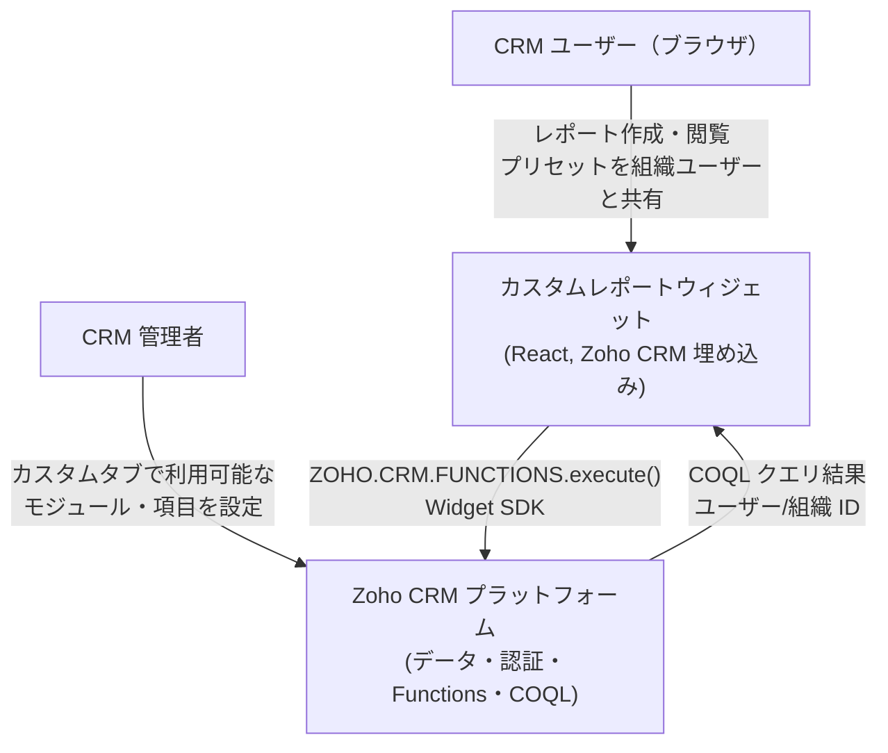
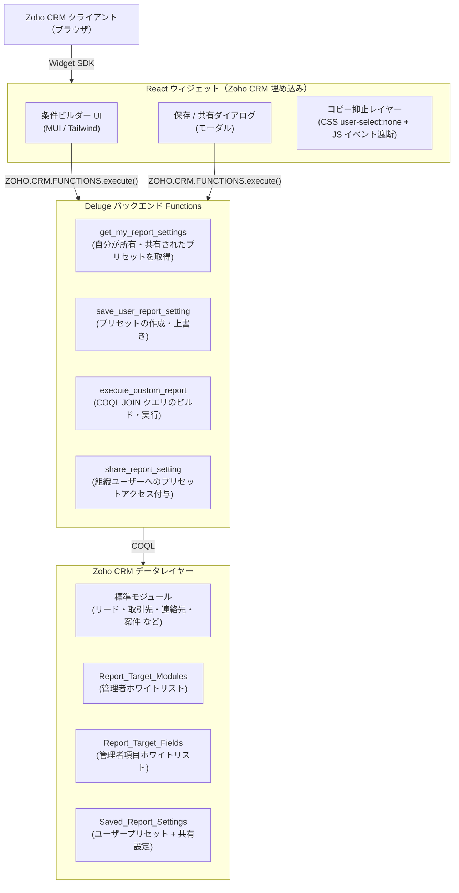

# HLD-CUSTOMREPORT-001: Zoho CRM カスタムレポートウィジェット

**作成日:** 2026-06-03
**ステータス:** ドラフト
**作成者:** Vivek
**レビュアー:** —
**プロジェクト:** CRM カスタムレポート
**PRD 参照:** `/home/vivek/project/INTERNAL/custom_report/requirement/customreport_functionality_req_new_en.md`
**ADR 参照:** —

---

## 0. 要件サマリー

PRD セクション 0 より抜粋。詳細は上記 PRD 参照。

### Must 要件

| 要件 | 対応方針 |
| :--- | :--- |
| **カジュアルコピー抑止**（右クリック・Ctrl+C・テキスト選択を遮断。DevTools やスクリーンショットは防止不可） | React 全体に CSS `user-select: none` を適用。JavaScript で `copy`（Ctrl+C）と `contextmenu`（右クリック）イベントを遮断しクリップボードへの転送をブロック。高感度データはアドミンホワイトリスト `Report_Target_Fields` から除外することが唯一の有効なアクセス制御。 |
| **お気に入り保存機能**（フィルター・項目順などの再利用） | 選択したソーステーブル・項目リスト（順序付き）・フィルター条件・集計/グループ設定を JSON 文字列としてシリアライズし `Saved_Report_Settings.Config_JSON` に保存。 |
| **作成者のみが再利用・編集可能**（他者による編集・削除不可） | 保存時に Deluge `zoho.loginuser` でユーザーを特定し、レコードの `Owner` として設定。`Saved_Report_Settings` カスタムタブの Zoho CRM 共有ルールを **Private** に設定し、システムレベルのアクセス制御を実施。 |
| **管理者制御のマスター**（対象タブ・項目・集計ルール） | 管理者専用マスタータブ（`Report_Target_Modules` / `Report_Target_Fields`）。ウィジェット起動時にマスターを読み込み、許可されたオブジェクト・項目・集計タイプのみをドロップダウンに表示。 |

### Want 要件

| 要件 | 対応方針 |
| :--- | :--- |
| **ルックアップ参照による JOIN 取得**（COQL 経由の関連タブアクセス） | `Report_Target_Fields` に `Is_Lookup` 属性を追加。選択時は COQL ドット記法（例: `SELECT Account_Name.Account_Name FROM Leads`）で親レコードの項目を動的に取得。明示的な JOIN ON 句は不要。 |
| **作成者以外のユーザーとの共有** | オーナー明示型共有: プリセットに共有先ユーザー/ロールを保存し、取得 WHERE 句に `OR share_target = logged_in_user` を追加。オプション: 共有 URL パラメーターを発行。 |
| **API クレジット消費への配慮** | `zoho.crm.coql` にデータアクセスを集約。1 ページ 100 件でページング（ユーザー起点）。現在ページを React State にキャッシュ。バックエンド呼び出しは「レポート生成」ボタン押下時のみ（オンデマンド実行・自動更新なし）。 |

---

## 1. 問題の背景

Zoho CRM の標準レポート機能は、動的なユーザー設定型マルチモジュール JOIN クエリと細粒度のアクセス制御をサポートしていない。ユーザーは CRM 管理者の介在なしにクロスモジュールのアドホックレポートを作成できず、保存したレポートプリセットを同組織の他ユーザーと共有する仕組みも存在しない。本機能は Zoho CRM にウィジェットとして直接埋め込まれたセルフサービス型レポートビルダーを提供する。

---

## 2. ゴールと非ゴール

### ゴール

- エンドユーザーが複数の Zoho CRM モジュールにまたがって項目を選択し、クロスモジュール COQL JOIN クエリを実行できるようにする。
- 管理者が定義したホワイトリストにより、クエリ可能なモジュールと項目を制限する。
- ユーザーが名前付きレポートプリセットを保存・上書き・読み込みできるようにする。
- ユーザーが同一 Zoho org の他ユーザーと保存プリセットを共有できるようにする（ユーザー/ロール明示共有または URL パラメーター共有）。
- 不正なデータ抽出を防止する: レポート結果のファイルダウンロードおよびクリップボードコピーを禁止。
- ページング・オンデマンド実行・React State キャッシュにより Zoho COQL クレジット上限内に収める。
- 関連モジュールの Lookup 項目アクセスに COQL ドット記法をサポートする（`SELECT Lookup.Field FROM Module`）。

### 非ゴール

- CSV・Excel などのファイル形式へのエクスポート・ダウンロード。
- Zoho org 外へのレポート結果の送信（メール・Webhook・外部ストレージ）。
- 表形式表示以外のカスタムグラフ・ビジュアライゼーション。
- リアルタイムまたはスケジュール（cron）実行。
- `Report_Target_Modules` および `Report_Target_Fields` の管理者 UI（Zoho CRM カスタムタブで直接管理することを前提とする）。

---

## 3. システムコンテキスト図（C4 L1）

---

## 4. コンテナ図（C4 L2）

---

## 5. データフロー

### 5.1 レポート実行フロー

1. ユーザーが管理者ホワイトリスト済みのドロップダウンからプライマリモジュールと関連モジュールを選択する。
2. 各モジュールから項目を選択し、任意でフィルター条件・集計ルールを設定する。
3. レポート条件は React State に保持される。**ユーザーが「レポート生成」を明示的にクリックするまでバックエンド呼び出しは行わない**（オンデマンド実行）。
4. ウィジェットが `ZOHO.CRM.FUNCTIONS.execute()` 経由で `execute_custom_report` Deluge Function を呼び出す。
5. Deluge がすべてのリクエストモジュール・項目を `Report_Target_Modules` / `Report_Target_Fields` に照合して検証する。
6. Lookup タイプの項目については、Deluge が明示的な JOIN ON 句ではなくドット記法（例: `SELECT Account_Name.Account_Name FROM Leads`）で COQL を構築する。
7. `zoho.crm.coql` で COQL を実行し、1 ページ 100 件でページングされた結果を返す。
8. 結果は JSON 配列として返され、**React State にキャッシュ**される。以降のソート・スクロールなどの UI 操作はキャッシュデータを使用し、追加のバックエンド呼び出しは発生しない。
9. ウィジェットがコピー抑止を有効にした読み取り専用テーブルとして結果をレンダリングする。

### 5.2 プリセット保存・共有フロー

1. ユーザーが保存をクリックし、保存ダイアログでプリセット名を入力する。
2. ウィジェットが `save_user_report_setting` を呼び出し、Deluge が現在のユーザーをオーナーとして `Saved_Report_Settings` に書き込む。
3. 共有する場合、ユーザーが Zoho org のユーザーを選択し、ウィジェットが `share_report_setting` を呼び出す。
4. Deluge が共有関係を保存する（共有ユーザー JSON フィールドまたは別テーブル）。元のオーナーは保持される。
5. 受信者が次回ウィジェットを開いたときに、プリセットリストに共有プリセットが表示される。

---

## 6. 外部連携

| 外部システム | 用途 | 認証方式 | 備考 |
|---|---|---|---|
| Zoho CRM Widget SDK | CRM ページへのウィジェット埋め込み、現在ユーザーコンテキストの取得 | Zoho Widget OAuth（SDK が自動処理） | `ZOHO.CRM.CONFIG.getCurrentUser()` |
| Zoho CRM Functions（Deluge） | サーバーサイドロジックの実行 | ウィジェットコンテキスト内で `ZOHO.CRM.FUNCTIONS.execute()` 経由で呼び出し | 追加の認証トークン不要 |
| Zoho CRM COQL | CRM データのクエリ; ドット記法による Lookup 項目アクセス | Deluge `zoho.crm.coql`（推奨; `page_size` は 1 リクエストあたり 100 件上限） | Zoho API クレジット上限の対象 |
| Zoho CRM カスタムタブ | 管理者設定・ユーザープリセットの永続化 | Deluge での CRM 標準レコード読み書き | `Report_Target_Modules`, `Report_Target_Fields`, `Saved_Report_Settings` |

---

## 7. セキュリティ境界

| 懸念事項 | 対応方針 |
|---|---|
| 認証 | Zoho CRM セッション — Widget SDK が現在ユーザーの ID を提供; 別途認証不要 |
| 認可 | COQL 構築前に Deluge がリクエストされた項目・モジュールを管理者ホワイトリストに照合して検証 |
| レポート共有スコープ | 共有は同一 Zoho CRM org のユーザーのみに制限; クロス org 共有はブロック |
| 転送中データ | すべての呼び出しは Zoho プラットフォーム内で HTTPS 通信; データは Zoho インフラ外に出ない |
| 保存データ | Zoho CRM カスタムタブに保存; Zoho プラットフォームの暗号化が適用される |
| **ダウンロード防止** | エクスポートエンドポイントは公開しない。フロントエンドにダウンロードボタンなし。`Blob` / `URL.createObjectURL` は呼び出さない。バックエンドは JSON のみ返却 — ファイルストリームなし。 |
| **カジュアルコピー抑止** | 結果テーブルに `user-select: none` を適用。`contextmenu` と `copy` イベントをウィジェット JS で遮断・キャンセル。DevTools やスクリーンショットは防止不可 — 真のアクセス制御は `Report_Target_Fields` ホワイトリストからの高感度項目除外で行う。 |
| **プリセットアクセス（プラットフォームレベル）** | `Saved_Report_Settings` カスタムタブを Zoho CRM 共有ルール = **Private** に設定。プラットフォームがオーナーのみレコードを閲覧・編集できるよう強制。共有アクセスはオーナーが明示的に付与。 |
| PII 項目 | レポート結果に CRM レコードの PII（氏名・メールアドレスなど）が含まれる場合がある — 表示のみ、ブラウザストレージには保存しない |

### 脅威モデル

| 脅威 | 軽減策 |
|---|---|
| ユーザーが管理者ホワイトリスト外のモジュールをクエリしようとする | Deluge が COQL 実行前にリクエストされたすべてのモジュール API 名を `Report_Target_Modules` に照合して検証。いずれかのモジュールが存在しない場合はクエリを拒否。 |
| ユーザーがフロントエンドのペイロード経由で悪意ある COQL 文字列を作成する | Deluge が検証済み・ホワイトリスト済みの項目名・モジュール名からプログラム的に COQL を構築 — ユーザーが提供した生の COQL 文字列は一切実行されない。 |
| ユーザーがブラウザクリップボード（Ctrl+C）でレポートデータをコピーしようとする | `copy` イベントリスナーで `event.preventDefault()` を呼び出し。`user-select: none` でドラッグ選択を防止。右クリックコンテキストメニューを抑制。注意: DevTools のネットワークタブやスクリーンショットは引き続きアクセス可能 — これはカジュアルコピー抑止であり、完全なコピー禁止ではない。 |
| 未認可ユーザーが他ユーザーの保存プリセットにアクセスしようとする | `Saved_Report_Settings` タブは Zoho CRM で共有ルール = Private に設定（プラットフォームレベルの強制）。Deluge が追加で `Owner = 現在ユーザー` または共有アクセスリストに含まれるかを多層防御として確認。 |
| COQL クレジット枯渇（大量クエリによる DoS） | 1 ページあたり 100 件上限でページング。Deluge がクエリあたり最大 2 Lookup トラバーサルを強制（COQL 公式制限）。フロントエンドが実行中は実行ボタンを無効化。 |
| org 外のユーザーが共有レポートにアクセスしようとする | Zoho プラットフォームが org レベルの認証を強制。共有リストには Zoho ユーザー ID を保存; Deluge が結果を返す前に現在のユーザー ID が共有リストに含まれることを検証。 |

---

## 8. 技術スタック

| レイヤー | 選択 | 理由 |
|---|---|---|
| フロントエンド | React 18+（Vite）、MUI v5 | 動的項目選択・ライブバリデーション・キャッシュ無効化フローの状態管理の複雑性から採用 — Zoho Widget プラットフォームの必須要件ではない。任意の JS フレームワーク（またはバニラ JS）でウィジェットを埋め込み可能。 |
| バックエンド | Deluge（Zoho CRM Functions） | Zoho CRM PaaS 内で利用可能な唯一のサーバーサイド実行環境 |
| データクエリ | Zoho COQL | CRM ネイティブのクエリ言語; マルチモジュール JOIN で唯一サポートされている構造化クエリ手段 |
| データストレージ | Zoho CRM カスタムタブ | 外部 DB 利用不可; カスタムタブがプラットフォーム内で永続的な構造化ストレージを提供 |
| スタイリング | MUI v5 + CSS | Zoho CRM ウィジェット iframe 内での一貫した外観 |

---

## 9. 主要技術的決定事項

- **外部バックエンドなし**: システムは Zoho CRM プラットフォーム内に完全に収容。追加インフラコストと認証の複雑性を回避できるが、クエリパフォーマンスの制御が COQL の制約に依存する。
- **管理者ホワイトリストモデル**: 自由形式の COQL を許可せず、クエリ可能なモジュールと項目はすべて管理者が事前承認。データ漏洩を防ぎ、COQL インジェクション対策を簡素化する。
- **Lookup 項目への COQL ドット記法**: 関連モジュールの項目は明示的な JOIN ON 句ではなく COQL ドット記法（例: `SELECT Account_Name.Account_Name FROM Leads`）でアクセス。動的構築が簡素で Zoho 推奨の COQL Lookup トラバーサルパターンに準拠する。
- **`zoho.crm.coql` を唯一のクエリ API として使用**: すべてのデータ取得を `zoho.crm.coql`（`page_size` は 1 ページあたり 100 件上限）に集約し、標準検索 API を使用しない。API クレジットを節約し N+1 フェッチパターンを排除する。（COQL のハード上限は 1 呼び出しあたり 2,000 件; クレジット節約とレスポンス時間のため 100 件に上限設定。）
- **React State キャッシュ + オンデマンド実行**: 取得結果を React State に保存。バックエンドはユーザーが「レポート生成」を明示的にクリックしたときのみ呼び出す。UI 操作（ソート・スクロール）はキャッシュデータで動作し、不要な API 呼び出しを排除する。
- **JSON プリセットストレージ**: レポート条件を `Config_JSON` にシリアライズされた JSON blob として保存。カスタムタブ項目変更なしで柔軟なスキーマ進化が可能だが、条件内部のサーバーサイドフィルター・検索は失う。
- **プリセットのプラットフォームレベル Private 共有**: `Saved_Report_Settings` を Zoho CRM 共有ルールで Private に設定。アプリケーションロジックとは独立したシステムレベルのアクセス制御を提供し、Deluge が共有アクセスの追加アプリケーションレベルチェックを実施する。
- **ファイルダウンロードを設計上禁止**: ダウンロード機能はセキュリティ要件として意図的に除外。将来のエクスポート要件は、別途承認フローを経る必要がある。

---

## 10. スケーラビリティと性能

| 指標 | 現在の推定値 | 限界点 |
|---|---|---|
| 同時接続ウィジェットユーザー | 約20〜50名 *（要再検証）* | Zoho Functions の同時実行上限はこの org で未確認; 検証完了まではリスクとして扱う |
| レポートクエリの取得件数 | 1 ページあたり 100 件 | COQL のハード上限は 1 リクエストあたり 2,000 件; クレジット節約とレスポンス時間のため 1 ページ 100 件に上限設定 |
| クエリあたりの JOIN モジュール数 | 最大 2 | COQL 公式仕様で Lookup トラバーサルは最大 2 に制限; これを超えると動作は未定義 |
| ユーザーあたりの保存プリセット数 | 無制限（CRM タブレコード） | 機能的上限なし; プリセット 50 件超では UI でのページングを推奨 |
| Zoho API クレジット消費 | COQL 呼び出し 1 回あたり約 1〜5 クレジット | Zoho は org あたりの日次 API 呼び出しクレジット上限を設けている; 高頻度利用は上限に近づく可能性あり |

### COQL JOIN パフォーマンス上の考慮事項

- **インデックス付き Lookup**: COQL の JOIN 条件は Zoho がインデックス付けする Lookup タイプ項目を参照する必要がある。プレーンテキスト項目（例: 名前文字列でのマッチング）での JOIN はサポートされておらず、項目ホワイトリストレベルでブロックされる（JOIN キーには `Data_Type = Lookup` が必須）。
- **大規模モジュールの JOIN**: レコード数が 10 万件超のモジュール（例: `リード`）は JOIN パフォーマンスが低下する。クロスモジュール JOIN 実行前に、インデックス付き項目（例: 日付範囲・担当者）での WHERE フィルターを最低 1 つ強制する。
- **全件スキャンよりページング**: 単一クエリで全件取得しない。常に `LIMIT 100 OFFSET N` でページングを適用する。結果セットがページングされている場合は UI でユーザーに警告する。
- **クレジット予算**: COQL 呼び出し 1 回あたり Zoho API クレジットを 1 消費。複数ページの取得は 1 ページにつき 1 クレジット消費。ページ数をユーザーに表示し、次ページの取得はユーザーの明示的な操作を必須とする（自動全件取得なし）。

---

## 11. 未解決の質問・リスク

| # | 質問 / リスク | 担当 | 解決予定日 |
|---|---|---|---|
| 1 | この org での正確な Zoho API クレジット上限は？ 安全な COQL 使用ガイドラインを設定するために日次上限を確認する必要がある。 | 管理者 | — |
| 2 | Zoho COQL は LEFT JOIN のみサポートするか、INNER JOIN もサポートするか？ マルチモジュールレポートでの null レコード処理に影響する。 | 開発者 | — |
| 3 | 1 つのプリセットを共有するユーザー数の見込みは？ ファンアウトが大きい場合、単一項目に JSON リストとしてユーザー ID を保存するのではなく、専用の結合テーブルが必要になる可能性がある。 | 開発者 | — |
| 4 | ウィジェット内で表示されるレポート出力に PII コンプライアンス要件（GDPR / 個人データ取り扱い）はあるか？ | 法務/管理者 | — |

---

## 12. HLD レビューチェックリスト

- [x] C4 L1 コンテキスト図の作成とレビュー完了
- [x] C4 L2 コンテナ図の作成とレビュー完了
- [x] すべての外部連携が認証方式とともに記載済み
- [x] セキュリティ境界の定義 — 認証・暗号化ポイントを特定
- [x] 脅威モデルに 3 シナリオ以上と軽減策を記載
- [x] 技術選定の理由を記載（単なる列挙ではなく）
- [x] スケーラビリティ推定値の記載 — 現在の負荷と最初のボトルネックを明示
- [x] 非ゴールを明示的に列挙
- [ ] LLD 開始前に少なくとも 1 名のレビュアーが承認
- [ ] 議論のあった決定・非自明な決定ごとに ADR を作成
