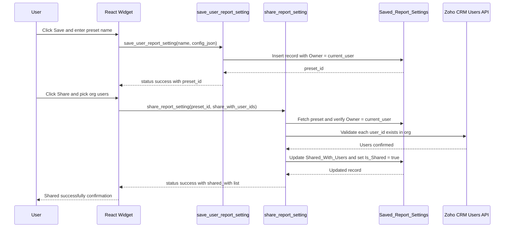
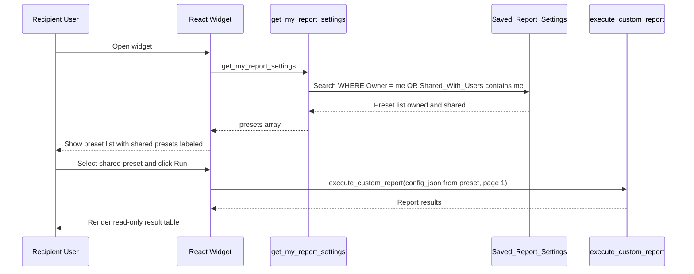
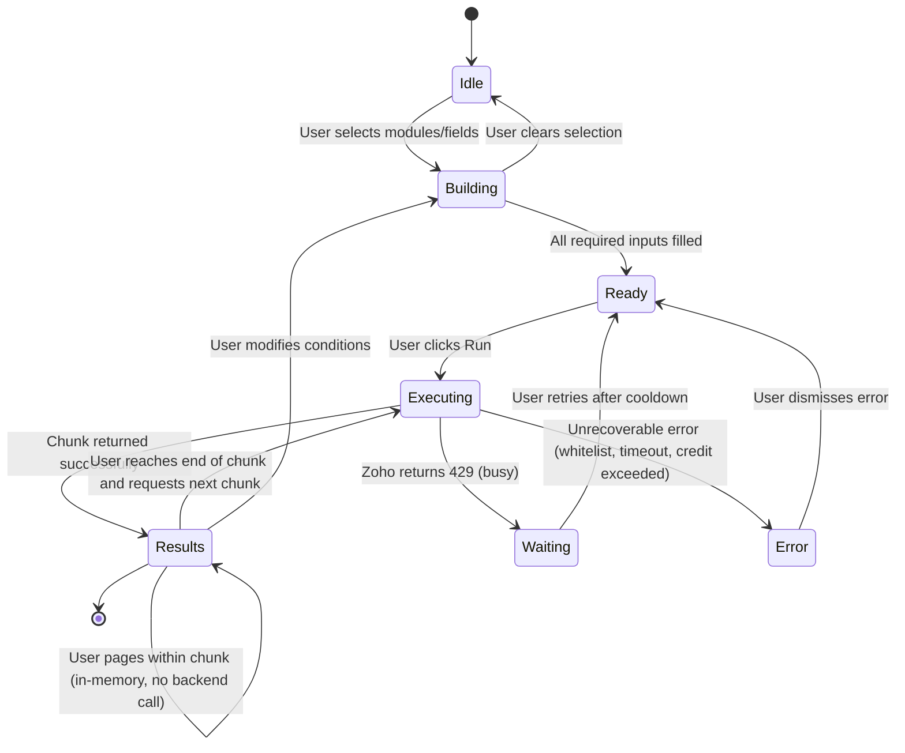
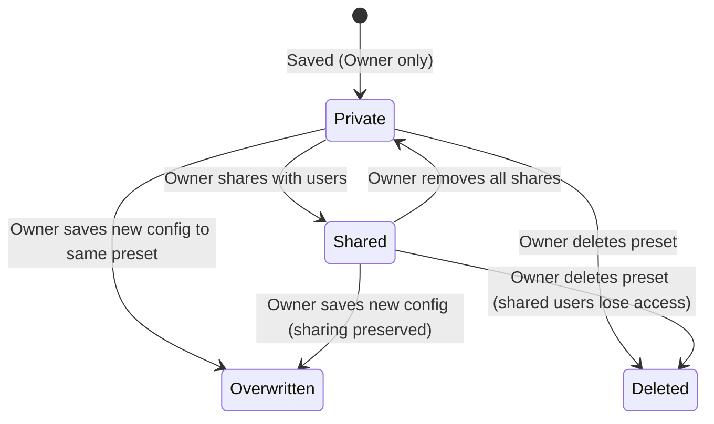

# LLD-CUSTOMREPORT-001: Zoho CRM Custom Report Widget

**Date:** 2026-06-03
**Status:** Draft
**Author:** Vivek
**Reviewers:** —
**Project:** CRM Custom Report
**HLD Reference:** `/home/vivek/project/INTERNAL/custom_report/design/HLD_custom_report.md`
**PRD Reference:** `/home/vivek/project/INTERNAL/custom_report/requirement/customreport_functionality_req_new_en.md`

---

## 1. Scope

| Requirement | Covered in Section |
|---|---|
| FR-001: Dynamic multi-module JOIN report builder | Section 3 — COQL Query Construction, Section 4 — Sequence Diagrams |
| FR-002: Admin whitelist for modules and fields | Section 2 — Data Model (`Report_Target_Modules`, `Report_Target_Fields`) |
| FR-003: Save and load named report presets | Section 2 — Data Model (`Saved_Report_Settings`), Section 3 — Deluge Function Contracts |
| FR-004: Share presets with other users in same org | Section 2 — Sharing Model, Section 3 — `share_report_setting` |
| FR-005: Prevent report download / clipboard copy | Section 6 — Copy & Download Prevention |
| FR-006: COQL credit limit management | Section 5 — COQL Credit & Pagination Strategy |
| FR-007: Multi-tab (module) JOIN with performance controls | Section 5 — JOIN Performance Design |
| FR-008: On-demand execution and React State caching | Section 3 — Frontend Caching Strategy |
| FR-009: COQL dot notation for Lookup field access | Section 4 — COQL Query Construction |
| FR-010: Platform-level private sharing for presets | Section 2 — `Saved_Report_Settings` Constraints |

---

## 2. Data Model

### Entity: `Report_Target_Modules` (Zoho CRM Custom Tab)

Admin-managed whitelist of modules available for report building.

| Field | API Name | Type | Required | Notes |
|---|---|---|---|---|
| Module Display Name | `Name` | Single Line (255) | Yes | Shown in UI dropdown |
| Module API Name | `Module_API_Name` | Single Line (100) | Yes | Unique. Used as COQL FROM / JOIN target |

**Constraints:**
- `Module_API_Name` must match a valid Zoho CRM module API name exactly (case-sensitive).
- Duplicate `Module_API_Name` records must be prevented at the admin input level.

---

### Entity: `Report_Target_Fields` (Zoho CRM Custom Tab)

Admin-managed whitelist of queryable fields per module.

| Field | API Name | Type | Required | Notes |
|---|---|---|---|---|
| Field Display Name | `Name` | Single Line (255) | Yes | Shown in UI field picker |
| Field API Name | `Field_API_Name` | Single Line (100) | Yes | Used in COQL SELECT / WHERE |
| Parent Module | `Target_Module` | Lookup → `Report_Target_Modules` | Yes | Module this field belongs to |
| Data Type | `Data_Type` | Picklist | Yes | `Text`, `Number`, `Date`, `PickList`, `Lookup` |
| Is Aggregatable | `Is_Aggregatable` | Checkbox | No | If true, eligible for SUM / AVG / COUNT / MAX / MIN |
| Is Groupable | `Is_Groupable` | Checkbox | No | If true, eligible for GROUP BY |
| Is Join Key | `Is_Join_Key` | Checkbox | No | If true, this field can be used as a JOIN ON condition. Must be `Data_Type = Lookup`. |

**Constraints:**
- `Is_Join_Key` may only be `true` when `Data_Type = Lookup`. Non-lookup fields cannot be used as related-field access keys.
- When `Is_Join_Key = true`, COQL dot notation is used for field access (`SELECT LookupField.TargetField FROM Module`) — no explicit JOIN ON clause.
- `Is_Aggregatable` and `Is_Groupable` are mutually exclusive for a given field in a single query (enforced in frontend).

---

### Entity: `Saved_Report_Settings` (Zoho CRM Custom Tab)

Stores user-created report presets including sharing metadata.

| Field | API Name | Type | Required | Notes |
|---|---|---|---|---|
| Setting Name | `Name` | Single Line (255) | Yes | User-defined label |
| Primary Module | `Target_Module` | Single Line (100) | Yes | Primary (FROM) module API name |
| Config JSON | `Config_JSON` | Multi Line (Long Text) | Yes | Full report config — see schema below |
| Owner | `Owner` | Lookup → Zoho User | Yes | Identified via `zoho.loginuser` at save time. Controls default visibility. |
| Shared With | `Shared_With_Users` | Multi Line | No | JSON array of Zoho User IDs who can read this preset. `[]` = private. |
| Is Shared | `Is_Shared` | Checkbox | No | Derived flag: true if `Shared_With_Users` is non-empty. Used for quick filter. |

**Platform Configuration (Required):**
- The `Saved_Report_Settings` custom tab **must** be configured with Zoho CRM **Sharing Rules = Private**. This ensures that only the record Owner can view or edit their presets at the platform level, independent of application logic.
- Shared access granted by the Owner is handled at the application level (Deluge WHERE clause) since Zoho's Private rule does not natively support field-based sharing exceptions.

#### `Config_JSON` Schema

```json
{
  "primary_module": "Leads",
  "select_fields": [
    { "field": "Last_Name" },
    { "field": "Annual_Revenue" },
    { "field": "Account_Name.Account_Name", "is_lookup": true },
    { "field": "Account_Name.Phone", "is_lookup": true }
  ],
  "filters": [
    {
      "field": "Lead_Status",
      "operator": "=",
      "value": "Open - Not Contacted"
    }
  ],
  "aggregations": [
    {
      "function": "SUM",
      "field": "Annual_Revenue",
      "alias": "Total_Revenue"
    }
  ],
  "group_by": [
    { "field": "Account_Name.Account_Name", "is_lookup": true }
  ],
  "page": 1,
  "page_size": 100
}
```

> Note: Lookup traversal fields use dot notation (`LookupField.TargetField`) and are flagged with `"is_lookup": true`. There are no explicit `joins` entries — Zoho COQL resolves the related module automatically via the Lookup field definition.

---

### Sharing Model

Three mechanisms are available. Option A is the primary implementation; Options B and C are alternatives.

**Option A — Stored User/Role List (primary)**

The `Shared_With_Users` field stores a JSON array of Zoho User IDs explicitly granted access by the Owner:

```json
["user_id_1", "user_id_2"]
```

Deluge retrieval adds `OR share_target = logged_in_user` to the WHERE clause:

```
visible_to_current_user = (record.Owner == current_user_id)
                        OR (current_user_id IN record.Shared_With_Users)
```

**Option B — URL Parameter Sharing (optional / future)**

The Owner can generate a time-limited share token stored as a field in the preset record. A recipient with the URL parameter can load and run the preset without needing to be in `Shared_With_Users`. Token validation is handled in Deluge before returning results.

**Cross-org sharing is blocked**: Zoho CRM enforces org-level session authentication. User IDs from other orgs cannot be resolved, so cross-org sharing fails silently in all options.

---

## 3. Deluge Function Contracts

All functions are invoked via `ZOHO.CRM.FUNCTIONS.execute(function_name, {arguments: payload})` from the React widget.

### Frontend Caching Strategy (FR-008)

To minimize API credit consumption:

- **On-demand execution**: The backend (`execute_custom_report`) is called **only** when the user explicitly clicks the "Generate Report" button. Changing field selections, filters, or aggregation settings updates React State only — no background calls.
- **Chunk-based React State cache**: Each backend call returns up to 2,000 records in a single COQL call. The full array is stored in `reportData` React State. The UI slices this array at 100 records per page — page turns within the chunk require **no backend call and consume no API credits**.
- **Next-chunk fetch**: When the user navigates to a page beyond the current chunk (i.e., requests records past index 2,000), the frontend calls `execute_custom_report` again with the next `chunk` index (`OFFSET` advanced by 2,000). A loading indicator is shown during the fetch — users experience "slow page turn" rather than an error.
- **Loading/progress state**: The frontend shows a progress spinner during any active backend call. If Zoho returns a 429 rate-limit error, the widget displays "Server is busy — please wait a moment and try again" rather than a hard error, so concurrent users experience slowness, not failure.
- **Cache invalidation**: The cache is cleared when the user clicks "Generate Report" again (new query) or modifies the report configuration. The UI shows a "Results may be outdated — click Generate to refresh" banner when config has changed since the last run.

```
User modifies config → React State updated → no backend call
User clicks "Generate Report" → clear cache → call execute_custom_report(chunk=0) → store 2,000-record chunk in reportData
User pages within chunk (page 1–20) → slice reportData in memory → no backend call
User navigates past page 20 → call execute_custom_report(chunk=1) → show loading → replace reportData with new chunk
User sorts table → operates on current reportData chunk → no backend call
```

---

### `get_my_report_settings`

**Purpose:** Return all presets the current user owns or has been shared with.

**Input:**
```json
{}
```

**Output:**
```json
{
  "status": "success",
  "presets": [
    {
      "id": "record_id",
      "name": "My Q1 Report",
      "primary_module": "Leads",
      "config_json": "{ ... }",
      "is_owner": true,
      "shared_with": []
    }
  ]
}
```

**Logic:**
1. Get `current_user_id` from `zoho.loginuser` (Deluge built-in; returns the executing user's ID).
2. Search `Saved_Report_Settings` where `Owner = current_user_id` — these are owned presets.
3. Search `Saved_Report_Settings` where `Shared_With_Users` contains `current_user_id` — these are shared presets.
4. Merge and deduplicate (a user cannot share a preset with themselves).
5. Return merged list.

**Error Responses:**

| Code | When |
|---|---|
| `AUTH_FAILED` | Cannot resolve current user from Zoho context |
| `FETCH_FAILED` | CRM search call fails |

---

### `save_user_report_setting`

**Purpose:** Create a new preset or overwrite an existing one owned by the current user.

**Input:**
```json
{
  "preset_id": "existing_record_id_or_null",
  "name": "My Report",
  "config_json": "{ ... }"
}
```

**Output:**
```json
{
  "status": "success",
  "preset_id": "record_id"
}
```

**Logic:**
1. Get `current_user_id` from `zoho.loginuser`.
2. Validate `config_json` parses as valid JSON.
3. If `preset_id` is provided: fetch record, confirm `Owner = current_user_id` (reject if not owner — cannot overwrite another user's preset).
4. Insert (create) or update (overwrite) the record in `Saved_Report_Settings`.
5. Return the saved record ID.

**Error Responses:**

| Code | When |
|---|---|
| `FORBIDDEN` | Attempting to overwrite a preset owned by another user |
| `INVALID_JSON` | `config_json` fails JSON parse |
| `SAVE_FAILED` | CRM insert/update call fails |

---

### `share_report_setting`

**Purpose:** Grant read access to a preset for one or more users in the same org.

**Input:**
```json
{
  "preset_id": "record_id",
  "share_with_user_ids": ["user_id_1", "user_id_2"]
}
```

**Output:**
```json
{
  "status": "success",
  "shared_with": ["user_id_1", "user_id_2"]
}
```

**Logic:**
1. Get `current_user_id` from `zoho.loginuser`.
2. Fetch the preset; confirm `Owner = current_user_id` (only owner can manage sharing).
3. Validate each user ID exists in the same Zoho org via `zoho.crm.searchRecords("users", ...)`.
4. Merge new user IDs into the existing `Shared_With_Users` list (deduplicate).
5. Update the record; set `Is_Shared = true`.
6. Return the updated full share list.

**Error Responses:**

| Code | When |
|---|---|
| `FORBIDDEN` | Current user is not the owner |
| `USER_NOT_FOUND` | A provided user ID does not exist in the org |
| `UPDATE_FAILED` | CRM update call fails |

---

### `execute_custom_report`

**Purpose:** Validate inputs, build a COQL JOIN query, execute with pagination, and return results.

**Input:**
```json
{
  "config_json": "{ ... }",
  "chunk": 0
}
```

> `chunk` is a zero-based index. `chunk=0` → `OFFSET 0`, `chunk=1` → `OFFSET 2000`, etc. The backend always fetches up to 2,000 records per call.

**Output:**
```json
{
  "status": "success",
  "data": [ { "Last_Name": "Smith", "Account_Name": "Acme Corp" } ],
  "chunk": 0,
  "chunk_size": 2000,
  "returned": 847,
  "has_more_chunks": true,
  "credits_used_estimate": 1
}
```

> `returned` is the actual count in `data` (≤ 2,000). `has_more_chunks: false` when the dataset is exhausted. The frontend handles UI pagination (100/page) by slicing `data` in memory — no additional backend calls until `has_more_chunks` and the user reaches the last UI page in the chunk.

**Logic:** See Section 4 (COQL Query Construction) for detailed build steps.

**Error Responses:**

| Code | When |
|---|---|
| `WHITELIST_VIOLATION` | A requested module or field is not in the admin whitelist |
| `JOIN_LIMIT_EXCEEDED` | More than 2 Lookup traversals requested (COQL official limit) |
| `NO_FILTER_ON_LARGE_MODULE` | Primary module exceeds threshold and no WHERE filter provided |
| `COQL_ERROR` | Zoho CRM rejects the generated COQL |
| `CREDIT_LIMIT_WARNING` | Estimated remaining daily credits fall below the configured threshold — execution is blocked |
| `TOO_MANY_REQUESTS` | Zoho API returns HTTP 429 (rate limit exceeded); execution is stopped and the user is asked to retry after a cooldown |
| `CREDIT_EXCEEDED` | Daily API credit quota is fully exhausted; no COQL call is made and the user is notified to contact the admin |
| `TIMEOUT` | COQL execution exceeds the Deluge function timeout; partial result is discarded and the user is asked to add a more restrictive WHERE filter |

---

## 4. COQL Query Construction

### 4.1 Validation Phase (before query build)

```
1. Parse config_json
2. Assert primary_module EXISTS in Report_Target_Modules
3. For each field in select_fields + filters + aggregations + group_by:
     if field.is_lookup == true:
       lookup_part = field.field.split(".")[0]   // e.g., "Account_Name"
       target_part = field.field.split(".")[1]   // e.g., "Account_Name"
       assert lookup_part EXISTS in Report_Target_Fields
         WHERE Target_Module = primary_module AND Is_Join_Key = true
     else:
       assert field.field EXISTS in Report_Target_Fields
         WHERE Target_Module = primary_module
4. Count lookup traversals (unique lookup_part values in select_fields)
   assert lookup_traversal_count <= 2   // COQL official max: 2 Lookup traversals per query
5. assert chunk >= 0                    // chunk index must be non-negative
   // page_size is always 2000; no client override allowed
```

### 4.2 Lookup Field Access via COQL Dot Notation (FR-009)

Related module fields are accessed using **COQL dot notation** — not explicit JOIN ON clauses. This is the recommended COQL pattern for Lookup-type field traversal and avoids the complexity of constructing JOIN conditions dynamically.

**Dot notation syntax:**

```sql
-- Access a Lookup field's related record field:
SELECT Last_Name, Account_Name.Account_Name, Account_Name.Phone
FROM Leads
WHERE Lead_Status = 'Open - Not Contacted'
LIMIT 2000 OFFSET 0   -- chunk=0; OFFSET = chunk * 2000
```

In this example, `Account_Name` is the Lookup field on `Leads`, and `Account_Name.Account_Name` / `Account_Name.Phone` access fields on the related `Accounts` record.

**How Deluge builds dot notation fields dynamically:**

```
For each field in select_fields where Is_Join_Key = true:
    dotNotationField = "{LookupFieldAPIName}.{TargetFieldAPIName}"
    Add to COQL SELECT list
```

**Comparison with explicit JOIN (not used):**

| Approach | Used | Reason |
|---|---|---|
| COQL dot notation (`LookupField.TargetField`) | Yes | Native COQL Lookup traversal; no JOIN ON required; simpler to build dynamically |
| Explicit `LEFT JOIN ... ON ...` | No | COQL does support explicit JOINs but dot notation is simpler for Lookup traversal and less error-prone |

**Performance rules enforced by the Deluge function:**

| Rule | Reason |
|---|---|
| Dot notation fields must have `Is_Join_Key = true` and `Data_Type = Lookup` | Only Lookup fields support dot notation. Plain text fields cannot traverse to related records. |
| Maximum 2 Lookup traversals per query | COQL official specification limits Lookup traversals to 2. Beyond this limit, Zoho may reject the query or return undefined results. |
| At least one `WHERE` filter required when the primary module has > 50,000 records | Full-scan over large modules (Leads, Contacts) without a filter hits credit limits and degrades performance. Deluge checks module record count before executing. |
| `LIMIT 2000 OFFSET (chunk * 2000)` | Fetch the maximum COQL allows per call. The frontend serves up to 20 UI pages (100 records each) from a single credit-consuming call. Next backend call fires only when the chunk is exhausted. |
| No `SELECT *` | Only explicitly whitelisted fields are included in SELECT, preventing accidental PII exposure from un-whitelisted fields. |
| All COQL executed via `zoho.crm.coql` | Consolidates all data access to a single API method (2,000 records per call, 1 credit per call). Avoids mixing standard search APIs which consume more credits per record. |

### 4.3 Aggregate Queries

When `aggregations` is non-empty, the query uses GROUP BY:

```sql
SELECT Account_Name.Account_Name, SUM(Annual_Revenue) AS Total_Revenue
FROM Leads
GROUP BY Account_Name.Account_Name
LIMIT 2000 OFFSET 0   -- chunk=0
```

Non-aggregate fields in `select_fields` must also appear in `group_by` (standard SQL rule — validated before query build).

### 4.4 COQL Credit Budget Management

Zoho CRM enforces a daily API credit quota per org. Each COQL call consumes 1 credit.

**Controls:**

| Control | Implementation |
|---|---|
| Fetch 2,000 records per backend call | Each COQL call (1 credit) returns a full chunk. The frontend serves up to 20 UI pages (100 records/page) from that chunk with zero additional credits. Reduces total credit consumption vs. 100-per-call approach by up to 20×. |
| Chunk fetch is user-initiated | No auto-chunk-loading. User must navigate to the last page in the current chunk before the next chunk loads. Prevents runaway credit consumption. |
| Credit warning | Deluge estimates remaining daily credits using `zoho.crm.getOrgVariable` (if available) and includes `credits_used_estimate` in every response. Frontend shows a warning banner when credit budget drops below a configurable threshold. |
| **Execution stop condition** | If estimated remaining credits < `CREDIT_STOP_THRESHOLD` (default: 50 credits), Deluge returns `CREDIT_EXCEEDED` immediately without executing the COQL query. The frontend displays a "Credit budget exhausted — contact admin" message. This threshold is configurable via an org variable so admins can adjust without code change. |
| `TOO_MANY_REQUESTS` handling | If `zoho.crm.coql` returns a 429 error, Deluge returns `TOO_MANY_REQUESTS` to the frontend. The frontend shows "Server is busy — please wait a moment and try again" (not a hard error). The Run button is re-enabled after 30 seconds. No retry loop in Deluge (avoids stacking credits). Users experience slowness, not failure — matching the team's intent for concurrent-user scenarios. |
| `TIMEOUT` handling | Deluge function timeout is typically 10–30s. If the COQL call does not return within the timeout budget, Deluge returns `TIMEOUT`. The frontend advises the user to add a more restrictive WHERE filter (e.g., date range on an indexed field). |
| Query complexity cap | 2 Lookup traversals max + 1 WHERE minimum on large modules limits per-query credit weight. |
| Admin visibility | `credits_used_estimate` is logged per execution for admin audit. |

---

## 5. Sequence Diagrams

### Flow 1: Execute Multi-Module Report

```mermaid
sequenceDiagram
    participant U as User
    participant FE as React Widget
    participant DF as execute_custom_report
    participant RTM as Report_Target_Modules
    participant RTF as Report_Target_Fields
    participant COQL as Zoho COQL Engine

    U->>FE: Select modules, fields, filters then click Run
    FE->>DF: execute_custom_report(config_json, chunk=0)
    DF->>RTM: Validate each requested module exists in whitelist
    RTM-->>DF: Validation OK or WHITELIST_VIOLATION
    DF->>RTF: Validate fields and check Is_Join_Key for JOIN fields
    RTF-->>DF: Validation OK or WHITELIST_VIOLATION
    DF->>DF: Assert Lookup traversal count <= 2
    DF->>DF: Build COQL with dot notation, WHERE, GROUP BY, LIMIT 2000 OFFSET 0
    DF->>COQL: Execute COQL query
    COQL-->>DF: Up to 2,000 result rows with has_more_chunks flag
    DF-->>FE: status, data[0..n], chunk, has_more_chunks, credits_used_estimate
    FE->>FE: Store full chunk in reportData state; show page 1 (rows 0–99)
    FE-->>U: Render read-only result table — page 1 of up to 20 (copy-protected)
```

### Flow 2: Save and Share a Preset



### Flow 3: Load Shared Preset and Re-run



---

## 6. Copy & Download Prevention

### 6.1 Frontend Controls

All result table DOM elements receive the following CSS:

```css
.report-result-table {
  user-select: none;
  -webkit-user-select: none;
  -moz-user-select: none;
}
```

JavaScript event interceptors attached at the widget root level:

```javascript
document.addEventListener('contextmenu', (e) => e.preventDefault());
document.addEventListener('copy', (e) => e.preventDefault());
document.addEventListener('cut', (e) => e.preventDefault());
```

The `keydown` listener blocks Ctrl+C / Cmd+C when focus is inside the result table:

```javascript
resultTableRef.current.addEventListener('keydown', (e) => {
  if ((e.ctrlKey || e.metaKey) && e.key === 'c') e.preventDefault();
});
```

### 6.2 Backend Controls

- The `execute_custom_report` function returns only a JSON payload. It never returns a file stream, Blob, or base64-encoded file.
- No Deluge function accepts a `format=csv` or similar parameter — such parameters are rejected as invalid.
- The frontend contains no `<a download>` element, no `Blob` construction, and no `URL.createObjectURL` call.

### 6.3 Limitations (Acknowledged)

Browser DevTools can always access network responses. These controls prevent casual copying and accidental export, not determined technical extraction. For high-sensitivity data, field-level access must be controlled at the admin whitelist level — exclude sensitive fields from `Report_Target_Fields`.

---

## 7. Performance Considerations

| Concern | Approach |
|---|---|
| Large module full scan | Enforced minimum WHERE clause on modules with > 50,000 records. Checked at Deluge validation time. |
| JOIN on non-indexed fields | Blocked at whitelist level: only `Is_Join_Key = true` fields (Lookup type) allowed as JOIN ON keys. |
| 2-way Lookup traversal limit | Maximum 2 Lookup traversals enforced (COQL official limit). Each additional traversal multiplies query scan cost and may cause Zoho to reject the query entirely. |
| N+1 fetch pattern | Single COQL query fetches all joined fields in one call. No separate per-row lookups. |
| Pagination | Backend fetches `LIMIT 2000 OFFSET (chunk * 2000)`. Frontend slices at 100/page in memory — no backend call for pages 2–20 within a chunk. Next backend call only at chunk boundary. |
| Credit exhaustion | Each backend call costs 1 credit (2,000 records). Up to 20 UI pages served per credit. Credit estimate returned in every response. Warning shown in UI when threshold breached. |
| Preset list load | `get_my_report_settings` uses indexed `Owner` Lookup field for owned presets. Shared preset lookup uses a string-contains search on `Shared_With_Users` — acceptable at low volume but degrades linearly as total preset records grow. |
| `Shared_With_Users` split decision | Keep `Shared_With_Users` as a JSON field in `Saved_Report_Settings` while total preset records ≤ 5,000 AND the string-contains search returns in < 2s in sandbox testing. If either condition is violated, migrate sharing data to a dedicated `Preset_Share` custom tab (fields: `Preset_ID` Lookup, `Shared_User_ID` text, `Granted_At` date) and update `get_my_report_settings` to JOIN against it. Re-evaluate at the 1,000-record mark during production monitoring. |

---

## 8. State Transitions

### Report Execution State (Frontend)



### Preset State (Backend)



---

## 9. Security Implementation

| Requirement | Implementation |
|---|---|
| Auth enforcement | `zoho.loginuser` called at the start of every Deluge function to identify the executing user. If user context is unavailable, function returns `AUTH_FAILED` immediately. |
| Whitelist authorization | Every field and module name in the incoming payload is validated against `Report_Target_Modules` / `Report_Target_Fields` before COQL is built. |
| Preset access (platform) | `Saved_Report_Settings` custom tab configured with Zoho CRM Sharing Rules = **Private**. Platform blocks access to records not owned by the current user before Deluge even runs. |
| Preset ownership | `save_user_report_setting` and `share_report_setting` verify `Owner == current_user_id` (from `zoho.loginuser`) before any mutation. |
| Shared preset access | `get_my_report_settings` returns only records where `Owner = me` OR `me IN Shared_With_Users`. No other records exposed. Platform Private rule is a defense-in-depth layer above this. |
| No download vector | No file endpoint, no Blob, no base64 response. Copy events intercepted in frontend. |
| Cross-org sharing blocked | User IDs validated via `zoho.crm.searchRecords("users")` — returns only users within the same org. |
| COQL injection prevention | COQL string is built programmatically from validated, whitelisted identifiers. No raw user input is concatenated into the COQL string. |
| PII fields | Admin controls PII exposure via `Report_Target_Fields` whitelist. Sensitive fields (e.g., SSN, bank account) should not be added to the whitelist. |

---

## 10. Directory Structure

```text
zoho-crm-report-widget/
├── app/
│   ├── index.html
│   ├── dist/                        (Vite build output)
│   └── src/
│       ├── index.js
│       ├── App.jsx                  (Root: loads presets, renders builder + results)
│       ├── App.css
│       └── components/
│           ├── ModuleSelector.jsx   (Primary module + JOIN module picker)
│           ├── FieldPicker.jsx      (Per-module field selection with type badges)
│           ├── FilterBuilder.jsx    (WHERE clause condition builder)
│           ├── AggregationPanel.jsx (SUM/AVG/COUNT + GROUP BY config)
│           ├── ResultTable.jsx      (Read-only table with copy prevention)
│           ├── PaginationBar.jsx    (Page N of M + Next Page button)
│           ├── PresetList.jsx       (Owned + shared preset list)
│           └── SaveDialog.jsx       (Name input + share user picker modal)
└── deluge/
    ├── get_my_report_settings.dg
    ├── save_user_report_setting.dg
    ├── share_report_setting.dg
    └── execute_custom_report.dg
```

---

## 11. Testing Requirements

### Unit Tests (Deluge — manual or Zoho sandbox)

| Test Case | Function | Coverage |
|---|---|---|
| Valid single-module query with dot notation Lookup field executes without error | `execute_custom_report` | Happy path — dot notation |
| Valid query with 2 Lookup traversals executes without error | `execute_custom_report` | Happy path — max traversals |
| Request with 3 Lookup traversals returns `JOIN_LIMIT_EXCEEDED` | `execute_custom_report` | Traversal cap (COQL official max is 2) |
| Zoho 429 response returns `TOO_MANY_REQUESTS` with no retry | `execute_custom_report` | Rate limit handling |
| Execution with credits < threshold returns `CREDIT_EXCEEDED` without calling COQL | `execute_custom_report` | Credit stop condition |
| Dot notation field on non-Lookup field returns `WHITELIST_VIOLATION` | `execute_custom_report` | Dot notation key validation |
| Request with module not in whitelist returns `WHITELIST_VIOLATION` | `execute_custom_report` | Whitelist enforcement |
| Save by non-owner returns `FORBIDDEN` | `save_user_report_setting` | Ownership check |
| Share with user outside org returns `USER_NOT_FOUND` | `share_report_setting` | Cross-org block |
| Shared preset appears in recipient's preset list | `get_my_report_settings` | Sharing visibility |
| Owned preset not visible in non-owner non-share list | `get_my_report_settings` | Privacy |

### Integration Tests

| Test Case | Systems Involved |
|---|---|
| Full report flow with Lookup dot notation: select fields → run → results display | React Widget + Deluge + COQL |
| Config change does NOT trigger backend call — only Generate Report button does | React Widget (state test) |
| Paging from page 1 to page 20 within a chunk makes zero backend calls | React Widget (state test) |
| Navigating to page 21 (chunk boundary) triggers one new backend call with chunk=1 | React Widget + Deluge |
| Second run uses fresh backend call, not stale cache | React Widget + Deluge |
| Save → share → recipient loads and runs | React Widget + Deluge + `Saved_Report_Settings` |
| Copy attempt on result table blocked | React Widget (browser event test) |
| Download attempt returns no file | React Widget (no download link present) |
| Large module query without WHERE is blocked | React Widget + Deluge |

---

## 12. LLD Review Checklist

Before development starts:

- [x] Every FR from the PRD is mapped to a section
- [x] All entities have required fields documented
- [x] JOIN key constraint (Lookup-only) documented
- [x] PII handling decision documented (whitelist controls exposure)
- [x] Every Deluge function has input schema, output schema, and error table
- [x] Pagination strategy defined (2,000-record chunk per backend call; UI slices at 100/page in memory; next backend call only at chunk boundary)
- [x] Sequence diagrams for all major flows (3+ systems)
- [x] Error handling defined for every function
- [x] State transition diagrams present (frontend + preset)
- [x] Copy and download prevention implementation specified
- [x] COQL credit budget strategy documented
- [x] Security implementation fully mapped
- [x] Test cases listed
- [ ] Deluge functions tested in Zoho sandbox
- [ ] HLD signed off before development starts
