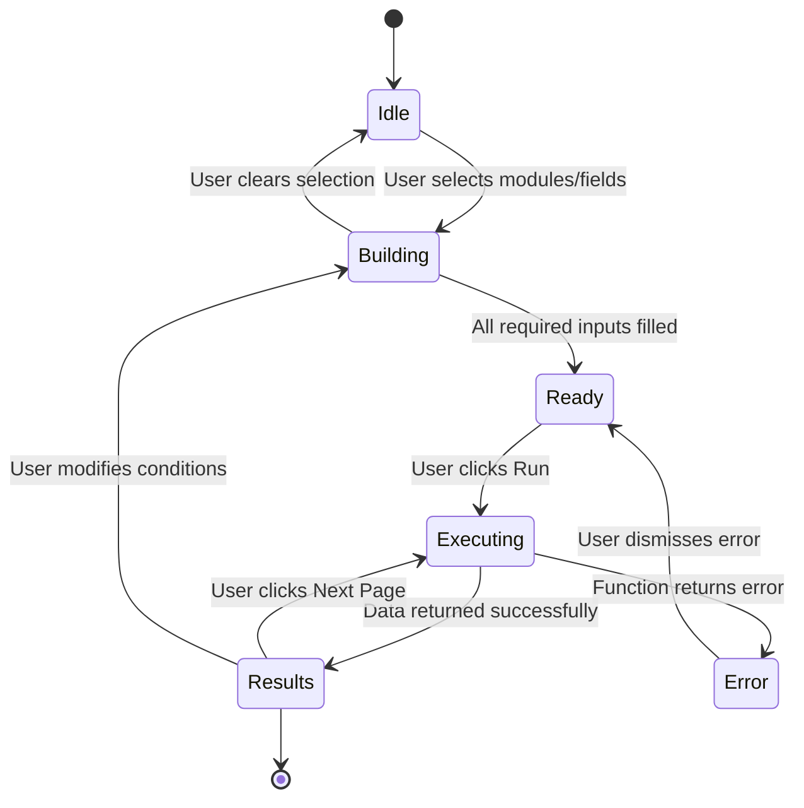
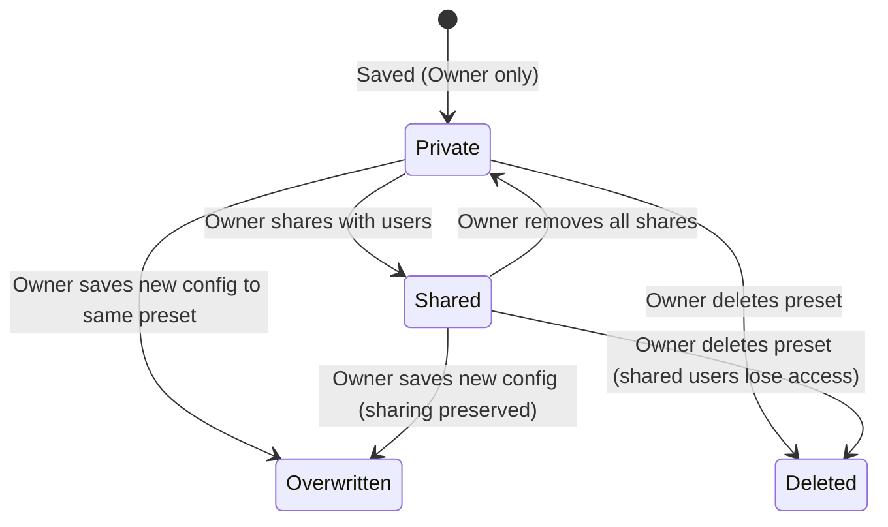

# LLD-CUSTOMREPORT-001: Zoho CRM Custom Report Widget

**Date:** 2026-06-03
**Status:** Draft
**Author:** Vivek
**Reviewers:** —
**Project:** CRM Custom Report
**HLD Reference:** `/home/vivek/project/INTERNAL/custom_report/design/HLD_custom_report.md`
**PRD Reference:** `/home/vivek/project/INTERNAL/custom_report/requirement/customreport_functionality_req.md`

---

## 1. Scope

| Requirement | Covered in Section |
|---|---|
| FR-001: Dynamic multi-module JOIN report builder | Section 3 — COQL Query Construction, Section 4 — Sequence Diagrams |
| FR-002: Admin whitelist for modules and fields | Section 2 — Data Model (`Report_Target_Modules`, `Report_Target_Fields`) |
| FR-003: Save and load named report presets | Section 2 — Data Model (`Saved_Report_Settings`), Section 3 — Deluge Function Contracts |
| FR-004: Share presets with other users in same org | Section 2 — Sharing Model, Section 3 — `share_report_setting` |
| FR-005: Prevent report download / clipboard copy | Section 6 — Copy & Download Prevention |
| FR-006: COQL credit limit management | Section 5 — COQL Credit & Pagination Strategy |
| FR-007: Multi-tab (module) JOIN with performance controls | Section 5 — JOIN Performance Design |

---

## 2. Data Model

### Entity: `Report_Target_Modules` (Zoho CRM Custom Tab)

Admin-managed whitelist of modules available for report building.

| Field | API Name | Type | Required | Notes |
|---|---|---|---|---|
| Module Display Name | `Name` | Single Line (255) | Yes | Shown in UI dropdown |
| Module API Name | `Module_API_Name` | Single Line (100) | Yes | Unique. Used as COQL FROM / JOIN target |

**Constraints:**
- `Module_API_Name` must match a valid Zoho CRM module API name exactly (case-sensitive).
- Duplicate `Module_API_Name` records must be prevented at the admin input level.

---

### Entity: `Report_Target_Fields` (Zoho CRM Custom Tab)

Admin-managed whitelist of queryable fields per module.

| Field | API Name | Type | Required | Notes |
|---|---|---|---|---|
| Field Display Name | `Name` | Single Line (255) | Yes | Shown in UI field picker |
| Field API Name | `Field_API_Name` | Single Line (100) | Yes | Used in COQL SELECT / WHERE |
| Parent Module | `Target_Module` | Lookup → `Report_Target_Modules` | Yes | Module this field belongs to |
| Data Type | `Data_Type` | Picklist | Yes | `Text`, `Number`, `Date`, `PickList`, `Lookup` |
| Is Aggregatable | `Is_Aggregatable` | Checkbox | No | If true, eligible for SUM / AVG / COUNT / MAX / MIN |
| Is Groupable | `Is_Groupable` | Checkbox | No | If true, eligible for GROUP BY |
| Is Join Key | `Is_Join_Key` | Checkbox | No | If true, this field can be used as a JOIN ON condition. Must be `Data_Type = Lookup`. |

**Constraints:**
- `Is_Join_Key` may only be `true` when `Data_Type = Lookup`. Non-lookup fields cannot be JOIN keys (not indexed in Zoho CRM).
- `Is_Aggregatable` and `Is_Groupable` are mutually exclusive for a given field in a single query (enforced in frontend).

---

### Entity: `Saved_Report_Settings` (Zoho CRM Custom Tab)

Stores user-created report presets including sharing metadata.

| Field | API Name | Type | Required | Notes |
|---|---|---|---|---|
| Setting Name | `Name` | Single Line (255) | Yes | User-defined label |
| Primary Module | `Target_Module` | Single Line (100) | Yes | Primary (FROM) module API name |
| Config JSON | `Config_JSON` | Multi Line (Long Text) | Yes | Full report config — see schema below |
| Owner | `Owner` | Lookup → Zoho User | Yes | Set to logged-in user on creation. Controls default visibility. |
| Shared With | `Shared_With_Users` | Multi Line | No | JSON array of Zoho User IDs who can read this preset. `[]` = private. |
| Is Shared | `Is_Shared` | Checkbox | No | Derived flag: true if `Shared_With_Users` is non-empty. Used for quick filter. |

#### `Config_JSON` Schema

```json
{
  "primary_module": "Leads",
  "joins": [
    {
      "module": "Accounts",
      "join_key_field": "Account_Name",
      "join_type": "LEFT"
    }
  ],
  "select_fields": [
    { "module": "Leads", "field": "Last_Name" },
    { "module": "Leads", "field": "Annual_Revenue" },
    { "module": "Accounts", "field": "Account_Name" }
  ],
  "filters": [
    {
      "module": "Leads",
      "field": "Lead_Status",
      "operator": "=",
      "value": "Open - Not Contacted"
    }
  ],
  "aggregations": [
    {
      "function": "SUM",
      "module": "Leads",
      "field": "Annual_Revenue",
      "alias": "Total_Revenue"
    }
  ],
  "group_by": [
    { "module": "Accounts", "field": "Account_Name" }
  ],
  "page": 1,
  "page_size": 200
}
```

---

### Sharing Model

Sharing is user-explicit (not role-based). The `Shared_With_Users` field stores a JSON array of Zoho User IDs:

```json
["user_id_1", "user_id_2"]
```

Access rule enforced in every Deluge function:

```
visible_to_current_user = (record.Owner == current_user_id)
                        OR (current_user_id IN record.Shared_With_Users)
```

**Cross-org sharing is blocked**: Zoho CRM enforces org-level session authentication. User IDs from other orgs cannot be resolved, so cross-org sharing fails silently.

---

## 3. Deluge Function Contracts

All functions are invoked via `ZOHO.CRM.FUNCTIONS.execute(function_name, {arguments: payload})` from the React widget.

---

### `get_my_report_settings`

**Purpose:** Return all presets the current user owns or has been shared with.

**Input:**
```json
{}
```

**Output:**
```json
{
  "status": "success",
  "presets": [
    {
      "id": "record_id",
      "name": "My Q1 Report",
      "primary_module": "Leads",
      "config_json": "{ ... }",
      "is_owner": true,
      "shared_with": []
    }
  ]
}
```

**Logic:**
1. Get `current_user_id` from `zoho.crm.getUser("me")`.
2. Search `Saved_Report_Settings` where `Owner = current_user_id` — these are owned presets.
3. Search `Saved_Report_Settings` where `Shared_With_Users` contains `current_user_id` — these are shared presets.
4. Merge and deduplicate (a user cannot share a preset with themselves).
5. Return merged list.

**Error Responses:**

| Code | When |
|---|---|
| `AUTH_FAILED` | Cannot resolve current user from Zoho context |
| `FETCH_FAILED` | CRM search call fails |

---

### `save_user_report_setting`

**Purpose:** Create a new preset or overwrite an existing one owned by the current user.

**Input:**
```json
{
  "preset_id": "existing_record_id_or_null",
  "name": "My Report",
  "config_json": "{ ... }"
}
```

**Output:**
```json
{
  "status": "success",
  "preset_id": "record_id"
}
```

**Logic:**
1. Validate `config_json` parses as valid JSON.
2. If `preset_id` is provided: fetch record, confirm `Owner = current_user_id` (reject if not owner — cannot overwrite another user's preset).
3. Insert (create) or update (overwrite) the record in `Saved_Report_Settings`.
4. Return the saved record ID.

**Error Responses:**

| Code | When |
|---|---|
| `FORBIDDEN` | Attempting to overwrite a preset owned by another user |
| `INVALID_JSON` | `config_json` fails JSON parse |
| `SAVE_FAILED` | CRM insert/update call fails |

---

### `share_report_setting`

**Purpose:** Grant read access to a preset for one or more users in the same org.

**Input:**
```json
{
  "preset_id": "record_id",
  "share_with_user_ids": ["user_id_1", "user_id_2"]
}
```

**Output:**
```json
{
  "status": "success",
  "shared_with": ["user_id_1", "user_id_2"]
}
```

**Logic:**
1. Fetch the preset; confirm `Owner = current_user_id` (only owner can manage sharing).
2. Validate each user ID exists in the same Zoho org via `zoho.crm.searchRecords("users", ...)`.
3. Merge new user IDs into the existing `Shared_With_Users` list (deduplicate).
4. Update the record; set `Is_Shared = true`.
5. Return the updated full share list.

**Error Responses:**

| Code | When |
|---|---|
| `FORBIDDEN` | Current user is not the owner |
| `USER_NOT_FOUND` | A provided user ID does not exist in the org |
| `UPDATE_FAILED` | CRM update call fails |

---

### `execute_custom_report`

**Purpose:** Validate inputs, build a COQL JOIN query, execute with pagination, and return results.

**Input:**
```json
{
  "config_json": "{ ... }",
  "page": 1,
  "page_size": 200
}
```

**Output:**
```json
{
  "status": "success",
  "data": [ { "Last_Name": "Smith", "Account_Name": "Acme Corp" } ],
  "page": 1,
  "page_size": 200,
  "has_more": true,
  "credits_used_estimate": 1
}
```

**Logic:** See Section 4 (COQL Query Construction) for detailed build steps.

**Error Responses:**

| Code | When |
|---|---|
| `WHITELIST_VIOLATION` | A requested module or field is not in the admin whitelist |
| `JOIN_LIMIT_EXCEEDED` | More than 3 JOIN modules requested |
| `NO_FILTER_ON_LARGE_MODULE` | Primary module exceeds threshold and no WHERE filter provided |
| `COQL_ERROR` | Zoho CRM rejects the generated COQL |
| `CREDIT_LIMIT_WARNING` | Estimated remaining daily credits fall below safe threshold |

---

## 4. COQL Query Construction

### 4.1 Validation Phase (before query build)

```
1. Parse config_json
2. For each module in [primary_module] + [joins[*].module]:
     assert module.Module_API_Name EXISTS in Report_Target_Modules
3. For each field in select_fields + filters + aggregations + group_by:
     assert field.Field_API_Name EXISTS in Report_Target_Fields
       WHERE Target_Module = that field's module
4. For each join:
     assert join.join_key_field has Is_Join_Key = true in Report_Target_Fields
       (guarantees the field is a Lookup, which is indexed)
5. assert len(joins) <= 3   // MAX JOIN LIMIT
6. assert page_size <= 200  // credit conservation
```

### 4.2 JOIN Condition Rules & Performance

COQL JOIN syntax follows Zoho's `JOIN` clause:

```sql
SELECT Leads.Last_Name, Accounts.Account_Name
FROM Leads
LEFT JOIN Accounts ON Leads.Account_Name = Accounts.id
WHERE Leads.Lead_Status = 'Open - Not Contacted'
LIMIT 200 OFFSET 0
```

**Performance rules enforced by the Deluge function:**

| Rule | Reason |
|---|---|
| JOIN keys must be `Lookup`-type fields only | Zoho indexes Lookup fields. Joining on plain text fields causes a full-scan — not supported in COQL. |
| Maximum 3 JOIN modules per query | Each additional JOIN multiplies query cost. Beyond 3-way JOIN, response times exceed acceptable thresholds on large modules. |
| At least one `WHERE` filter required when the primary module has > 50,000 records | Full-scan over large modules (Leads, Contacts) without a filter hits credit limits and degrades performance. Deluge checks module record count before executing. |
| `LIMIT` fixed at `page_size` (max 200 per page); `OFFSET = (page - 1) * page_size` | COQL hard limit is 2,000 per request. We cap at 200 to conserve credits and keep response time < 5s. |
| No `SELECT *` | Only explicitly whitelisted fields are included in SELECT, preventing accidental PII exposure from un-whitelisted fields. |

### 4.3 Aggregate Queries

When `aggregations` is non-empty, the query uses GROUP BY:

```sql
SELECT Accounts.Account_Name, SUM(Leads.Annual_Revenue) AS Total_Revenue
FROM Leads
LEFT JOIN Accounts ON Leads.Account_Name = Accounts.id
GROUP BY Accounts.Account_Name
LIMIT 200 OFFSET 0
```

Non-aggregate fields in `select_fields` must also appear in `group_by` (standard SQL rule — validated before query build).

### 4.4 COQL Credit Budget Management

Zoho CRM enforces a daily API credit quota per org. Each COQL call consumes 1 credit.

**Controls:**

| Control | Implementation |
|---|---|
| `page_size` capped at 200 | Reduces credits needed vs. fetching 2,000 records at once |
| Page fetch is user-initiated | No auto-pagination. User must click "Load Next Page". Prevents runaway credit consumption. |
| Credit warning | Deluge estimates remaining daily credits using `zoho.crm.getOrgVariable` (if available) and includes `credits_used_estimate` in every response. Frontend shows a warning banner when credit budget drops below a configurable threshold. |
| Query complexity cap | 3 JOINs + 1 WHERE minimum on large modules limits per-query credit weight. |
| Admin visibility | `credits_used_estimate` is logged per execution for admin audit. |

---

## 5. Sequence Diagrams

### Flow 1: Execute Multi-Module Report

```mermaid
sequenceDiagram
    participant U as User
    participant FE as React Widget
    participant DF as Deluge: execute_custom_report
    participant RTM as Report_Target_Modules (CRM Tab)
    participant RTF as Report_Target_Fields (CRM Tab)
    participant COQL as Zoho COQL Engine

    U->>FE: Select modules, fields, filters; click Run
    FE->>DF: execute_custom_report({config_json, page:1, page_size:200})
    DF->>RTM: Validate each requested module exists in whitelist
    RTM-->>DF: Validation OK / WHITELIST_VIOLATION
    DF->>RTF: Validate each requested field exists; check Is_Join_Key for JOIN fields
    RTF-->>DF: Validation OK / WHITELIST_VIOLATION
    DF->>DF: Assert JOIN count <= 3
    DF->>DF: Build COQL string with JOIN ON, WHERE, GROUP BY, LIMIT/OFFSET
    DF->>COQL: Execute COQL query
    COQL-->>DF: Result rows (up to 200) + has_more flag
    DF-->>FE: {status, data, page, has_more, credits_used_estimate}
    FE-->>U: Render read-only result table (copy-protected)
```

### Flow 2: Save and Share a Preset

```mermaid
sequenceDiagram
    participant U as User
    participant FE as React Widget
    participant DS as Deluge: save_user_report_setting
    participant DSh as Deluge: share_report_setting
    participant SRS as Saved_Report_Settings (CRM Tab)
    participant ZU as Zoho CRM Users API

    U->>FE: Click Save; enter preset name
    FE->>DS: save_user_report_setting({name, config_json})
    DS->>SRS: Insert record (Owner = current_user)
    SRS-->>DS: preset_id
    DS-->>FE: {status: success, preset_id}

    U->>FE: Click Share; pick users from org user list
    FE->>DSh: share_report_setting({preset_id, share_with_user_ids})
    DSh->>SRS: Fetch preset; verify Owner = current_user
    DSh->>ZU: Validate each user_id exists in org
    ZU-->>DSh: Users confirmed
    DSh->>SRS: Update Shared_With_Users, set Is_Shared = true
    SRS-->>DSh: Updated record
    DSh-->>FE: {status: success, shared_with: [...]}
    FE-->>U: "Shared successfully" confirmation
```

### Flow 3: Load Shared Preset and Re-run

```mermaid
sequenceDiagram
    participant U2 as Recipient User
    participant FE as React Widget
    participant DG as Deluge: get_my_report_settings
    participant SRS as Saved_Report_Settings (CRM Tab)
    participant DF as Deluge: execute_custom_report

    U2->>FE: Open widget
    FE->>DG: get_my_report_settings({})
    DG->>SRS: Search records WHERE Owner = me OR Shared_With_Users contains me
    SRS-->>DG: Preset list (owned + shared)
    DG-->>FE: {presets: [...]}
    FE-->>U2: Show preset list (shared presets labeled)
    U2->>FE: Select shared preset; click Run
    FE->>DF: execute_custom_report({config_json from preset, page:1})
    DF-->>FE: Report results
    FE-->>U2: Render read-only result table
```

---

## 6. Copy & Download Prevention

### 6.1 Frontend Controls

All result table DOM elements receive the following CSS:

```css
.report-result-table {
  user-select: none;
  -webkit-user-select: none;
  -moz-user-select: none;
}
```

JavaScript event interceptors attached at the widget root level:

```javascript
document.addEventListener('contextmenu', (e) => e.preventDefault());
document.addEventListener('copy', (e) => e.preventDefault());
document.addEventListener('cut', (e) => e.preventDefault());
```

The `keydown` listener blocks Ctrl+C / Cmd+C when focus is inside the result table:

```javascript
resultTableRef.current.addEventListener('keydown', (e) => {
  if ((e.ctrlKey || e.metaKey) && e.key === 'c') e.preventDefault();
});
```

### 6.2 Backend Controls

- The `execute_custom_report` function returns only a JSON payload. It never returns a file stream, Blob, or base64-encoded file.
- No Deluge function accepts a `format=csv` or similar parameter — such parameters are rejected as invalid.
- The frontend contains no `<a download>` element, no `Blob` construction, and no `URL.createObjectURL` call.

### 6.3 Limitations (Acknowledged)

Browser DevTools can always access network responses. These controls prevent casual copying and accidental export, not determined technical extraction. For high-sensitivity data, field-level access must be controlled at the admin whitelist level — exclude sensitive fields from `Report_Target_Fields`.

---

## 7. Performance Considerations

| Concern | Approach |
|---|---|
| Large module full scan | Enforced minimum WHERE clause on modules with > 50,000 records. Checked at Deluge validation time. |
| JOIN on non-indexed fields | Blocked at whitelist level: only `Is_Join_Key = true` fields (Lookup type) allowed as JOIN ON keys. |
| 3-way JOIN performance | Maximum 3 JOIN modules enforced. Each additional JOIN multiplies query scan cost. |
| N+1 fetch pattern | Single COQL query fetches all joined fields in one call. No separate per-row lookups. |
| Pagination | `LIMIT 200 OFFSET N` per page. User-initiated next-page to prevent auto-draining credits. |
| Credit exhaustion | `page_size` capped at 200. Credit estimate returned in every response. Warning shown in UI when threshold breached. |
| Preset list load | `get_my_report_settings` uses indexed `Owner` Lookup field for owned presets. Shared preset lookup uses a string-contains search on `Shared_With_Users` — may be slow if that field has many records; consider a separate join table if preset volume exceeds 10,000. |

---

## 8. State Transitions

### Report Execution State (Frontend)



### Preset State (Backend)



---

## 9. Security Implementation

| Requirement | Implementation |
|---|---|
| Auth enforcement | `zoho.crm.getUser("me")` called at the start of every Deluge function. If user context is unavailable, function returns `AUTH_FAILED` immediately. |
| Whitelist authorization | Every field and module name in the incoming payload is validated against `Report_Target_Modules` / `Report_Target_Fields` before COQL is built. |
| Preset ownership | `save_user_report_setting` and `share_report_setting` verify `Owner == current_user_id` before any mutation. |
| Shared preset access | `get_my_report_settings` returns only records where `Owner = me` OR `me IN Shared_With_Users`. No other records exposed. |
| No download vector | No file endpoint, no Blob, no base64 response. Copy events intercepted in frontend. |
| Cross-org sharing blocked | User IDs validated via `zoho.crm.searchRecords("users")` — returns only users within the same org. |
| COQL injection prevention | COQL string is built programmatically from validated, whitelisted identifiers. No raw user input is concatenated into the COQL string. |
| PII fields | Admin controls PII exposure via `Report_Target_Fields` whitelist. Sensitive fields (e.g., SSN, bank account) should not be added to the whitelist. |

---

## 10. Directory Structure

```text
zoho-crm-report-widget/
├── app/
│   ├── index.html
│   ├── dist/                        (Vite build output)
│   └── src/
│       ├── index.js
│       ├── App.jsx                  (Root: loads presets, renders builder + results)
│       ├── App.css
│       └── components/
│           ├── ModuleSelector.jsx   (Primary module + JOIN module picker)
│           ├── FieldPicker.jsx      (Per-module field selection with type badges)
│           ├── FilterBuilder.jsx    (WHERE clause condition builder)
│           ├── AggregationPanel.jsx (SUM/AVG/COUNT + GROUP BY config)
│           ├── ResultTable.jsx      (Read-only table with copy prevention)
│           ├── PaginationBar.jsx    (Page N of M + Next Page button)
│           ├── PresetList.jsx       (Owned + shared preset list)
│           └── SaveDialog.jsx       (Name input + share user picker modal)
└── deluge/
    ├── get_my_report_settings.dg
    ├── save_user_report_setting.dg
    ├── share_report_setting.dg
    └── execute_custom_report.dg
```

---

## 11. Testing Requirements

### Unit Tests (Deluge — manual or Zoho sandbox)

| Test Case | Function | Coverage |
|---|---|---|
| Valid 2-module JOIN config executes without error | `execute_custom_report` | Happy path |
| Request with module not in whitelist returns `WHITELIST_VIOLATION` | `execute_custom_report` | Whitelist enforcement |
| Request with 4 JOIN modules returns `JOIN_LIMIT_EXCEEDED` | `execute_custom_report` | JOIN cap |
| JOIN key field without `Is_Join_Key = true` returns `WHITELIST_VIOLATION` | `execute_custom_report` | JOIN key validation |
| Save by non-owner returns `FORBIDDEN` | `save_user_report_setting` | Ownership check |
| Share with user outside org returns `USER_NOT_FOUND` | `share_report_setting` | Cross-org block |
| Shared preset appears in recipient's preset list | `get_my_report_settings` | Sharing visibility |
| Owned preset not visible in non-owner non-share list | `get_my_report_settings` | Privacy |

### Integration Tests

| Test Case | Systems Involved |
|---|---|
| Full report flow: select fields → run → paginate | React Widget + Deluge + COQL |
| Save → share → recipient loads and runs | React Widget + Deluge + `Saved_Report_Settings` |
| Copy attempt on result table blocked | React Widget (browser event test) |
| Download attempt returns no file | React Widget (no download link present) |
| Large module query without WHERE is blocked | React Widget + Deluge |

---

## 12. LLD Review Checklist

Before development starts:

- [x] Every FR from the PRD is mapped to a section
- [x] All entities have required fields documented
- [x] JOIN key constraint (Lookup-only) documented
- [x] PII handling decision documented (whitelist controls exposure)
- [x] Every Deluge function has input schema, output schema, and error table
- [x] Pagination strategy defined (user-initiated, 200/page)
- [x] Sequence diagrams for all major flows (3+ systems)
- [x] Error handling defined for every function
- [x] State transition diagrams present (frontend + preset)
- [x] Copy and download prevention implementation specified
- [x] COQL credit budget strategy documented
- [x] Security implementation fully mapped
- [x] Test cases listed
- [ ] Deluge functions tested in Zoho sandbox
- [ ] HLD signed off before development starts
