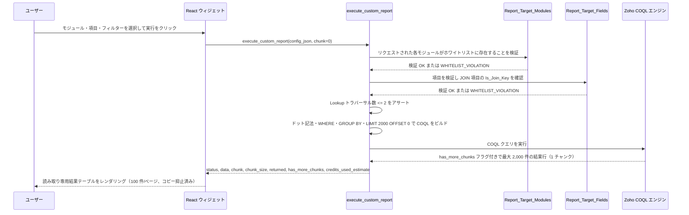
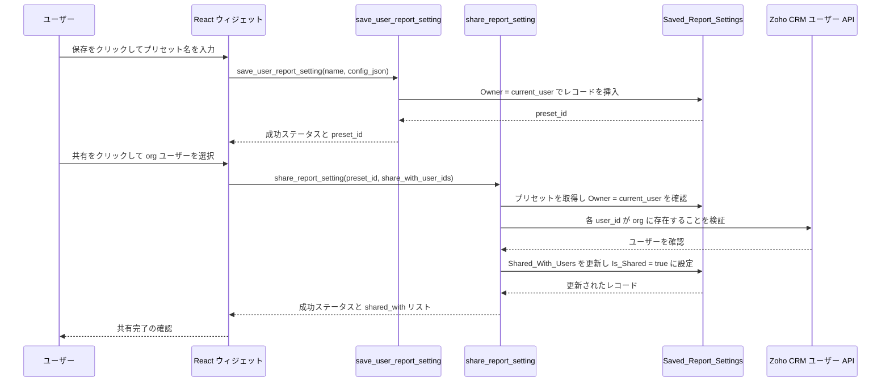
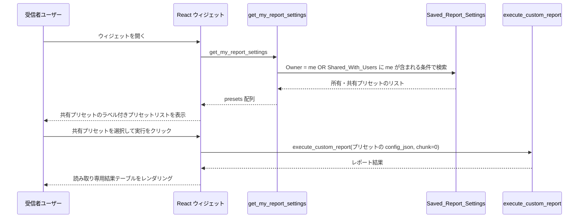
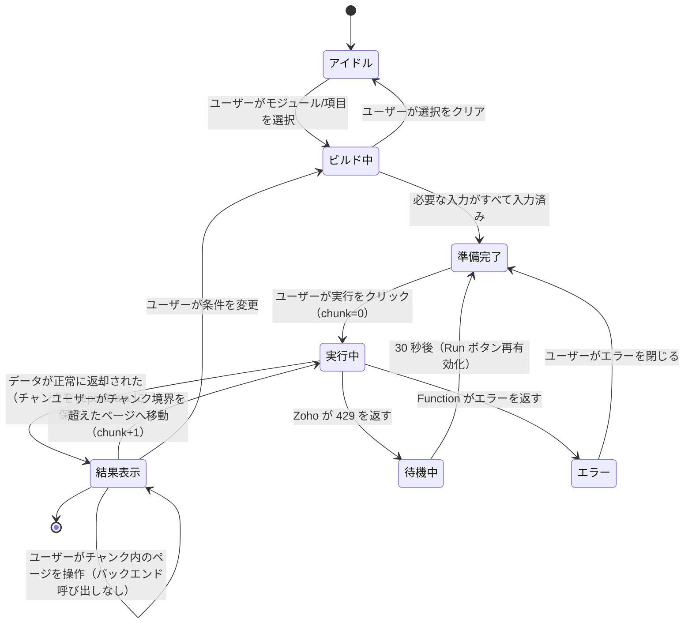
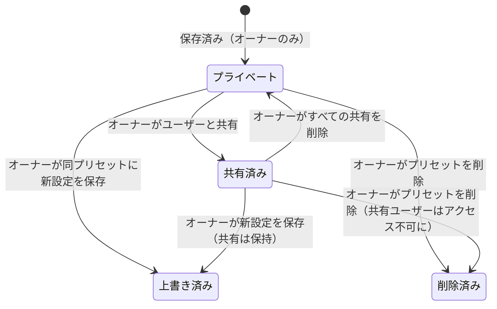

# LLD-CUSTOMREPORT-001: Zoho CRM カスタムレポートウィジェット

---

## 1. スコープ

| 要件 | 対応セクション |
|---|---|
| FR-001: 動的マルチモジュール JOIN レポートビルダー | セクション 3 — COQL クエリ構築、セクション 4 — シーケンス図 |
| FR-002: モジュール・項目の管理者ホワイトリスト | セクション 2 — データモデル（`Report_Target_Modules`、`Report_Target_Fields`） |
| FR-003: 名前付きレポートプリセットの保存・読み込み | セクション 2 — データモデル（`Saved_Report_Settings`）、セクション 3 — Deluge Function 仕様 |
| FR-004: 同一 org 内の他ユーザーとのプリセット共有 | セクション 2 — 共有モデル、セクション 3 — `share_report_setting` |
| FR-005: レポートのダウンロード・クリップボードコピーの防止 | セクション 6 — コピー・ダウンロード防止 |
| FR-006: COQL クレジット上限の管理 | セクション 5 — COQL クレジット・ページング戦略 |
| FR-007: パフォーマンス制御付きマルチタブ（モジュール）JOIN | セクション 5 — JOIN パフォーマンス設計 |
| FR-008: オンデマンド実行と React State キャッシュ | セクション 3 — フロントエンドキャッシュ戦略 |
| FR-009: Lookup 項目アクセスのための COQL ドット記法 | セクション 4 — COQL クエリ構築 |
| FR-010: プリセットのプラットフォームレベル Private 共有 | セクション 2 — `Saved_Report_Settings` 制約 |

---

## 2. データモデル

### エンティティ: `Report_Target_Modules`（Zoho CRM カスタムタブ）

レポートビルディングに使用可能なモジュールの管理者管理ホワイトリスト。

| 項目 | API 名 | 型 | 必須 | 備考 |
|---|---|---|---|---|
| モジュール表示名 | `Name` | Single Line (255) | Yes | UI ドロップダウンに表示 |
| モジュール API 名 | `Module_API_Name` | Single Line (100) | Yes | 一意。COQL の FROM / JOIN ターゲットとして使用 |

**制約:**
- `Module_API_Name` は有効な Zoho CRM モジュール API 名と完全に一致する必要がある（大文字小文字区別あり）。
- `Module_API_Name` の重複レコードは管理者入力レベルで防止する。

---

### エンティティ: `Report_Target_Fields`（Zoho CRM カスタムタブ）

モジュールごとのクエリ可能な項目の管理者管理ホワイトリスト。

| 項目 | API 名 | 型 | 必須 | 備考 |
|---|---|---|---|---|
| 項目表示名 | `Name` | Single Line (255) | Yes | UI 項目ピッカーに表示 |
| 項目 API 名 | `Field_API_Name` | Single Line (100) | Yes | COQL の SELECT / WHERE で使用 |
| 親モジュール | `Target_Module` | Lookup → `Report_Target_Modules` | Yes | この項目が属するモジュール |
| データ型 | `Data_Type` | Picklist | Yes | `Text`, `Number`, `Date`, `PickList`, `Lookup` |
| 集計可否 | `Is_Aggregatable` | Checkbox | No | true の場合 SUM / AVG / COUNT / MAX / MIN の対象 |
| グループ化可否 | `Is_Groupable` | Checkbox | No | true の場合 GROUP BY の対象 |
| JOIN キー | `Is_Join_Key` | Checkbox | No | true の場合 JOIN ON 条件として使用可能。`Data_Type = Lookup` であること。 |

**制約:**
- `Is_Join_Key` は `Data_Type = Lookup` のときのみ `true` にできる。Lookup 以外の項目は関連項目アクセスキーとして使用不可。
- `Is_Join_Key = true` の場合、COQL ドット記法で項目アクセスを行う（`SELECT LookupField.TargetField FROM Module`）— 明示的な JOIN ON 句は使用しない。
- `Is_Aggregatable` と `Is_Groupable` は、単一クエリ内で同一項目に対して排他的（フロントエンドで強制）。

---

### エンティティ: `Saved_Report_Settings`（Zoho CRM カスタムタブ）

共有メタデータを含むユーザー作成レポートプリセットを保存。

| 項目 | API 名 | 型 | 必須 | 備考 |
|---|---|---|---|---|
| 設定名 | `Name` | Single Line (255) | Yes | ユーザー定義ラベル |
| プライマリモジュール | `Target_Module` | Single Line (100) | Yes | プライマリ（FROM）モジュールの API 名 |
| 設定 JSON | `Config_JSON` | Multi Line (Long Text) | Yes | レポート設定全体 — 下記スキーマ参照 |
| オーナー | `Owner` | Lookup → Zoho ユーザー | Yes | 保存時に `zoho.loginuser` で特定。デフォルトの可視性を制御。 |
| 共有先 | `Shared_With_Users` | Multi Line | No | 読み取りアクセスが付与された Zoho ユーザー ID の JSON 配列。`[]` = プライベート。 |
| 共有済み | `Is_Shared` | Checkbox | No | 派生フラグ: `Shared_With_Users` が空でない場合 true。クイックフィルター用。 |

**プラットフォーム設定（必須）:**
- `Saved_Report_Settings` カスタムタブは Zoho CRM **共有ルール = Private** に設定する**必須**がある。これにより、アプリケーションロジックとは独立して、プラットフォームレベルでオーナーのみがプリセットを閲覧・編集できることが保証される。
- オーナーが付与した共有アクセスはアプリケーションレベル（Deluge WHERE 句）で処理する。Zoho の Private ルールはネイティブに項目ベースの共有例外をサポートしないため。

#### `Config_JSON` スキーマ

```json
{
  "primary_module": "Leads",
  "select_fields": [
    { "field": "Last_Name" },
    { "field": "Annual_Revenue" },
    { "field": "Account_Name.Account_Name", "is_lookup": true },
    { "field": "Account_Name.Phone", "is_lookup": true }
  ],
  "filters": [
    {
      "field": "Lead_Status",
      "operator": "=",
      "value": "Open - Not Contacted"
    }
  ],
  "aggregations": [
    {
      "function": "SUM",
      "field": "Annual_Revenue",
      "alias": "Total_Revenue"
    }
  ],
  "group_by": [
    { "field": "Account_Name.Account_Name", "is_lookup": true }
  ]
}
```

> 注記: Lookup トラバーサル項目はドット記法（`LookupField.TargetField`）を使用し `"is_lookup": true` でフラグを立てる。明示的な `joins` エントリはない — Zoho COQL が Lookup 項目定義を通じて関連モジュールを自動的に解決する。

---

### 共有モデル

3 つのメカニズムが利用可能。オプション A が主実装; オプション B・C は代替案。

**オプション A — 保存ユーザー/ロールリスト（主実装）**

`Shared_With_Users` 項目に、オーナーが明示的にアクセス付与した Zoho ユーザー ID の JSON 配列を保存:

```json
["user_id_1", "user_id_2"]
```

Deluge の取得処理は WHERE 句に `OR share_target = logged_in_user` を追加:

```
visible_to_current_user = (record.Owner == current_user_id)
                        OR (current_user_id IN record.Shared_With_Users)
```

**オプション B — URL パラメーター共有（オプション / 将来対応）**

オーナーがプリセットレコードの項目に保存された時間制限付き共有トークンを生成できる。URL パラメーターを持つ受信者は `Shared_With_Users` に追加されることなくプリセットを読み込んで実行できる。トークン検証は結果を返す前に Deluge で処理する。

**クロス org 共有はブロック**: Zoho CRM は org レベルのセッション認証を強制。他の org のユーザー ID は解決できないため、クロス org 共有はすべてのオプションでサイレントに失敗する。

---

## 3. Deluge Function 仕様

すべての Function は React ウィジェットから `ZOHO.CRM.FUNCTIONS.execute(function_name, {arguments: payload})` で呼び出される。

### フロントエンドキャッシュ戦略（FR-008）

API クレジット消費を最小化するために:

- **オンデマンド実行**: バックエンド（`execute_custom_report`）はユーザーが「レポート生成」ボタンを明示的にクリックしたときの**み**呼び出す。項目選択・フィルター・集計設定の変更は React State のみを更新 — バックグラウンド呼び出しは発生しない。
- **チャンクベース React State キャッシュ**: `execute_custom_report` は 1 回の COQL 呼び出しで最大 2,000 件（1 チャンク）を返す。チャンク全体を `reportData` React State 配列に保存する。UI は 100 件/ページでこの in-memory 配列をスライス表示 — チャンク内のページ操作はバックエンド呼び出しなし・クレジット消費なし。
- **チャンク境界でのフェッチ**: ユーザーが現在のチャンクの最終レコードを超えたページ（例: 2,000 件チャンクならページ 21）へ移動したとき、`chunk` パラメーターをインクリメントして `execute_custom_report` を再呼び出しする。新しい 2,000 件チャンクが `reportData` を置き換える。
- **キャッシュ無効化**: ユーザーが再度「レポート生成」をクリック（新規クエリ、`chunk=0`）またはレポート設定を変更するとキャッシュはクリアされる。最後の実行以降に設定が変更された場合、UI に「結果が古い可能性があります — 更新するにはレポート生成をクリックしてください」バナーを表示する。

```
ユーザーが設定変更 → React State 更新 → バックエンド呼び出しなし
ユーザーが「レポート生成」クリック → キャッシュクリア → execute_custom_report(chunk=0) 呼び出し → 2,000 件チャンクを reportData state に保存
ユーザーがチャンク内（ページ 1〜20）をページング → reportData を in-memory でスライス → バックエンド呼び出しなし
ユーザーがページ 21 へ移動（チャンク境界超え）→ execute_custom_report(chunk=1) 呼び出し → ローディング表示 → reportData を新チャンクで置換
```

---

### `get_my_report_settings`

**目的:** 現在ユーザーが所有または共有されているすべてのプリセットを返す。

**入力:**
```json
{}
```

**出力:**
```json
{
  "status": "success",
  "presets": [
    {
      "id": "record_id",
      "name": "Q1 レポート",
      "primary_module": "Leads",
      "config_json": "{ ... }",
      "is_owner": true,
      "shared_with": []
    }
  ]
}
```

**ロジック:**
1. `zoho.loginuser`（Deluge 組み込み; 実行ユーザーの ID を返す）から `current_user_id` を取得。
2. `Owner = current_user_id` の `Saved_Report_Settings` を検索 — 所有プリセット。
3. `Shared_With_Users` に `current_user_id` が含まれる `Saved_Report_Settings` を検索 — 共有プリセット。
4. マージして重複を除去（ユーザーは自分自身と共有できない）。
5. マージされたリストを返す。

**エラーレスポンス:**

| コード | 発生条件 |
|---|---|
| `AUTH_FAILED` | Zoho コンテキストから現在ユーザーを解決できない |
| `FETCH_FAILED` | CRM 検索呼び出しが失敗する |

---

### `save_user_report_setting`

**目的:** 新規プリセットを作成するか、現在ユーザーが所有する既存プリセットを上書きする。

**入力:**
```json
{
  "preset_id": "existing_record_id_or_null",
  "name": "マイレポート",
  "config_json": "{ ... }"
}
```

**出力:**
```json
{
  "status": "success",
  "preset_id": "record_id"
}
```

**ロジック:**
1. `zoho.loginuser` から `current_user_id` を取得。
2. `config_json` が有効な JSON としてパースできることを検証。
3. `preset_id` が提供されている場合: レコードを取得し `Owner = current_user_id` であることを確認（オーナーでない場合は拒否 — 他ユーザーのプリセットを上書き不可）。
4. `Saved_Report_Settings` にレコードを挿入（作成）または更新（上書き）する。
5. 保存されたレコード ID を返す。

**エラーレスポンス:**

| コード | 発生条件 |
|---|---|
| `FORBIDDEN` | 他ユーザーが所有するプリセットを上書きしようとしている |
| `INVALID_JSON` | `config_json` の JSON パースが失敗する |
| `SAVE_FAILED` | CRM の挿入/更新呼び出しが失敗する |

---

### `share_report_setting`

**目的:** 同一 org の 1 人以上のユーザーにプリセットへの読み取りアクセスを付与する。

**入力:**
```json
{
  "preset_id": "record_id",
  "share_with_user_ids": ["user_id_1", "user_id_2"]
}
```

**出力:**
```json
{
  "status": "success",
  "shared_with": ["user_id_1", "user_id_2"]
}
```

**ロジック:**
1. `zoho.loginuser` から `current_user_id` を取得。
2. プリセットを取得し `Owner = current_user_id` であることを確認（共有管理はオーナーのみ可能）。
3. `zoho.crm.searchRecords("users", ...)` 経由で各ユーザー ID が同一 Zoho org に存在することを検証。
4. 新しいユーザー ID を既存の `Shared_With_Users` リストにマージ（重複除去）。
5. レコードを更新し `Is_Shared = true` に設定。
6. 更新された完全な共有リストを返す。

**エラーレスポンス:**

| コード | 発生条件 |
|---|---|
| `FORBIDDEN` | 現在ユーザーがオーナーではない |
| `USER_NOT_FOUND` | 提供されたユーザー ID が org 内に存在しない |
| `UPDATE_FAILED` | CRM 更新呼び出しが失敗する |

---

### `execute_custom_report`

**目的:** 入力を検証し、COQL JOIN クエリをビルドし、ページングで実行して結果を返す。

**入力:**
```json
{
  "config_json": "{ ... }",
  "chunk": 0
}
```

**出力:**
```json
{
  "status": "success",
  "data": [ { "Last_Name": "山田", "Account_Name": "株式会社サンプル" } ],
  "chunk": 0,
  "chunk_size": 2000,
  "returned": 847,
  "has_more_chunks": true,
  "credits_used_estimate": 1
}
```

**ロジック:** 詳細なビルド手順はセクション 4（COQL クエリ構築）を参照。

**エラーレスポンス:**

| コード | 発生条件 |
|---|---|
| `WHITELIST_VIOLATION` | リクエストされたモジュールまたは項目が管理者ホワイトリストに存在しない |
| `JOIN_LIMIT_EXCEEDED` | 2 件を超える Lookup トラバーサルがリクエストされた（COQL 公式上限） |
| `NO_FILTER_ON_LARGE_MODULE` | プライマリモジュールが閾値を超えているが WHERE フィルターが指定されていない |
| `COQL_ERROR` | Zoho CRM が生成された COQL を拒否する |
| `CREDIT_LIMIT_WARNING` | 推定残余日次クレジットが設定済み閾値を下回る — 実行をブロック |
| `TOO_MANY_REQUESTS` | Zoho API が HTTP 429（レート制限超過）を返す; 実行を停止しクールダウン後の再試行をユーザーに促す |
| `CREDIT_EXCEEDED` | 日次 API クレジットクォータが完全に枯渇; COQL 呼び出しを行わず管理者への連絡をユーザーに通知 |
| `TIMEOUT` | COQL 実行が Deluge Function タイムアウトを超過; 部分的な結果は破棄され、より制限的な WHERE フィルターの追加をユーザーに促す |

---

## 4. COQL クエリ構築

### 4.1 検証フェーズ（クエリビルド前）

```
1. config_json をパース
2. primary_module が Report_Target_Modules に存在することをアサート
3. select_fields + filters + aggregations + group_by の各項目について:
     if field.is_lookup == true:
       lookup_part = field.field.split(".")[0]   // 例: "Account_Name"
       target_part = field.field.split(".")[1]   // 例: "Account_Name"
       lookup_part が Report_Target_Fields に存在することをアサート
         WHERE Target_Module = primary_module AND Is_Join_Key = true
     else:
       field.field が Report_Target_Fields に存在することをアサート
         WHERE Target_Module = primary_module
4. Lookup トラバーサル数（select_fields 内の一意の lookup_part 値）をカウント
   lookup_traversal_count <= 2 をアサート  // COQL 公式上限: クエリあたり 2 Lookup トラバーサル
5. chunk >= 0 をアサート                  // 有効なゼロベースのチャンクインデックス
```

### 4.2 COQL ドット記法による Lookup 項目アクセス（FR-009）

関連モジュールの項目は**COQL ドット記法**でアクセスする — 明示的な JOIN ON 句は使用しない。これは Lookup タイプ項目トラバーサルの推奨 COQL パターンであり、JOIN 条件を動的に構築する複雑性を回避できる。

**ドット記法の構文:**

```sql
-- Lookup 項目の関連レコード項目へのアクセス（chunk=0）:
SELECT Last_Name, Account_Name.Account_Name, Account_Name.Phone
FROM Leads
WHERE Lead_Status = 'Open - Not Contacted'
LIMIT 2000 OFFSET 0
```

この例では `Account_Name` が `Leads` の Lookup 項目であり、`Account_Name.Account_Name` / `Account_Name.Phone` が関連する `Accounts` レコードの項目にアクセスしている。

**Deluge によるドット記法項目の動的構築方法:**

```
select_fields 内で Is_Join_Key = true の各項目について:
    dotNotationField = "{LookupFieldAPIName}.{TargetFieldAPIName}"
    COQL SELECT リストに追加
```

**明示的 JOIN との比較（不使用）:**

| アプローチ | 使用 | 理由 |
|---|---|---|
| COQL ドット記法（`LookupField.TargetField`） | Yes | ネイティブ COQL Lookup トラバーサル; JOIN ON 不要; 動的構築が簡素 |
| 明示的 `LEFT JOIN ... ON ...` | No | COQL は明示的 JOIN をサポートするが、Lookup トラバーサルにはドット記法の方が簡素でエラーが少ない |

**Deluge Function が強制するパフォーマンスルール:**

| ルール | 理由 |
|---|---|
| ドット記法項目は `Is_Join_Key = true` かつ `Data_Type = Lookup` であること | Lookup 項目のみドット記法をサポート。プレーンテキスト項目は関連レコードをトラバースできない。 |
| クエリあたり最大 2 Lookup トラバーサル | COQL 公式仕様で Lookup トラバーサルは最大 2 に制限。この上限を超えると Zoho がクエリを拒否または未定義の結果を返す可能性がある。 |
| プライマリモジュールのレコード数が 50,000 件超の場合、最低 1 つの WHERE フィルターが必須 | フィルターなしで大規模モジュール（リード・連絡先）を全件スキャンするとクレジットを圧迫しパフォーマンスが低下する。Deluge が実行前にモジュールのレコード数を確認する。 |
| `LIMIT 2000 OFFSET (chunk * 2000)` — `chunk` はゼロベースのインデックス | COQL のハード上限は 1 リクエストあたり 2,000 件。バックエンドはチャンク全体を取得; UI は in-memory で 100 件/ページにスライス。 |
| `SELECT *` 禁止 | ホワイトリストに明示された項目のみ SELECT に含める。ホワイトリスト外の項目による不意の PII 露出を防止。 |
| すべての COQL を `zoho.crm.coql` 経由で実行 | 単一の API メソッドにデータアクセスを集約（COQL ハード上限: 1 呼び出し 2,000 件; 1 ページあたり 100 件に上限設定）。標準検索 API よりクレジット消費が少ない。 |

### 4.3 集計クエリ

`aggregations` が空でない場合、クエリは GROUP BY を使用:

```sql
SELECT Account_Name.Account_Name, SUM(Annual_Revenue) AS Total_Revenue
FROM Leads
GROUP BY Account_Name.Account_Name
LIMIT 2000 OFFSET 0  -- chunk=0; OFFSET = chunk * 2000
```

`select_fields` 内の非集計項目は `group_by` にも存在する必要がある（標準 SQL ルール — クエリビルド前に検証）。

### 4.4 COQL クレジット予算管理

Zoho CRM は org あたりの日次 API クレジットクォータを強制する。COQL 呼び出し 1 回あたり 1 クレジットを消費する。

**制御:**

| 制御 | 実装 |
|---|---|
| バックエンド呼び出し 1 回でチャンク全体（最大 2,000 件）を取得 | チャンク内の 20 ページを 1 クレジットで提供。1 ページ 100 件のアプローチと比較して最大 20 倍のクレジット節約。 |
| ページ取得はユーザー起点 | 自動ページングなし。ユーザーが「次のページを読み込む」をクリックする必要がある。クレジットの無制限消費を防止。 |
| クレジット警告 | Deluge が `zoho.crm.getOrgVariable`（利用可能な場合）を使用して残余日次クレジットを推定し、毎レスポンスに `credits_used_estimate` を含める。クレジット予算が設定済み閾値を下回るとフロントエンドに警告バナーを表示。 |
| **実行停止条件** | 推定残余クレジット < `CREDIT_STOP_THRESHOLD`（デフォルト: 50 クレジット）の場合、Deluge は COQL クエリを実行せず即座に `CREDIT_EXCEEDED` を返す。フロントエンドに「クレジット予算が枯渇しました — 管理者にお問い合わせください」メッセージを表示する。この閾値は org 変数で設定可能なため管理者はコード変更なしで調整できる。 |
| `TOO_MANY_REQUESTS` ハンドリング | `zoho.crm.coql` が 429 エラーを返した場合、Deluge はフロントエンドに `TOO_MANY_REQUESTS` を返す。フロントエンドに「サーバーが混んでいます — しばらく待ってから再試行してください」メッセージを表示し、Run ボタンを 30 秒間無効化する。Deluge 側でのリトライループなし（クレジット積み上げを回避）。ユーザーはエラーではなく遅延を体感する。 |
| `TIMEOUT` ハンドリング | Deluge Function のタイムアウトは通常 10〜30 秒。COQL 呼び出しがタイムアウト予算内に返らない場合、Deluge は `TIMEOUT` を返す。フロントエンドはインデックス付き項目（例: 日付範囲）でより制限的な WHERE フィルターを追加するようユーザーに案内する。 |
| クエリ複雑度の上限 | Lookup トラバーサル最大 2 件 + 大規模モジュールでの最低 1 件の WHERE によりクエリあたりのクレジット負荷を制限。 |
| 管理者への可視性 | 管理者監査のため実行ごとに `credits_used_estimate` をログ記録。 |

---

## 5. シーケンス図

### フロー 1: マルチモジュールレポートの実行



### フロー 2: プリセットの保存と共有



### フロー 3: 共有プリセットの読み込みと再実行



---

## 6. コピー・ダウンロード防止

### 6.1 フロントエンド制御

すべての結果テーブル DOM 要素に以下の CSS を適用:

```css
.report-result-table {
  user-select: none;
  -webkit-user-select: none;
  -moz-user-select: none;
}
```

ウィジェットルートレベルで JavaScript イベントインターセプターを設定:

```javascript
document.addEventListener('contextmenu', (e) => e.preventDefault());
document.addEventListener('copy', (e) => e.preventDefault());
document.addEventListener('cut', (e) => e.preventDefault());
```

`keydown` リスナーで結果テーブルにフォーカスがある場合に Ctrl+C / Cmd+C をブロック:

```javascript
resultTableRef.current.addEventListener('keydown', (e) => {
  if ((e.ctrlKey || e.metaKey) && e.key === 'c') e.preventDefault();
});
```

### 6.2 バックエンド制御

- `execute_custom_report` Function は JSON ペイロードのみを返す。ファイルストリーム・Blob・base64 エンコードされたファイルは一切返さない。
- `format=csv` などのパラメーターを受け付ける Deluge Function は存在しない — そのようなパラメーターは無効として拒否される。
- フロントエンドには `<a download>` 要素・`Blob` 構築・`URL.createObjectURL` 呼び出しは一切含まれない。

### 6.3 制限事項（既認識）

ブラウザの DevTools はネットワークレスポンスに常にアクセスできる。これらの制御は不注意なコピーと意図しないエクスポートを防止するものであり、技術的に決意した抽出は防止できない。高感度データについては管理者ホワイトリストレベルで項目アクセスを制御する — `Report_Target_Fields` から機密項目を除外すること。

---

## 7. パフォーマンス上の考慮事項

| 懸念事項 | 対応方針 |
|---|---|
| 大規模モジュールの全件スキャン | レコード数 50,000 件超のモジュールに最低 1 件の WHERE 句を強制。Deluge 検証時に確認。 |
| インデックス付きでない項目への JOIN | ホワイトリストレベルでブロック: JOIN ON キーとして使用できるのは `Is_Join_Key = true` の項目（Lookup タイプ）のみ。 |
| 2 方向 Lookup トラバーサル上限 | 最大 2 Lookup トラバーサルを強制（COQL 公式上限）。追加のトラバーサルはクエリスキャンコストを乗算し、Zoho がクエリ全体を拒否する可能性がある。 |
| N+1 フェッチパターン | 単一の COQL クエリで JOIN 済みの全項目を一括取得。行ごとの個別ルックアップなし。 |
| ページング | バックエンド呼び出し 1 回で最大 2,000 件を取得（`LIMIT 2000 OFFSET (chunk * 2000)`）。UI は in-memory チャンクを 100 件/ページでスライス — チャンク内のページはクレジット消費なし。チャンク境界超えのみ新規バックエンド呼び出し。 |
| クレジット枯渇 | チャンク内の最大 20 ページを 1 クレジットで提供。毎レスポンスでクレジット推定値を返却。閾値を超えると UI に警告を表示。 |
| プリセットリストの読み込み | `get_my_report_settings` は所有プリセットにインデックス付きの `Owner` Lookup 項目を使用。共有プリセットの検索は `Shared_With_Users` への文字列含有検索を使用 — 低件数では許容範囲だが、プリセットレコード総数の増加とともに線形に低下する。 |
| `Shared_With_Users` の別テーブル化判断 | 総プリセットレコード数 ≤ 5,000 件かつサンドボックステストでの文字列含有検索が 2 秒以内に返る間は `Saved_Report_Settings` 内の JSON 項目として `Shared_With_Users` を維持する。いずれかの条件が違反された場合、共有データを専用の `Preset_Share` カスタムタブ（項目: `Preset_ID` Lookup・`Shared_User_ID` テキスト・`Granted_At` 日付）に移行し、`get_my_report_settings` を更新して JOIN を使用する。本番監視での 1,000 件到達時に再評価する。 |

---

## 8. 状態遷移

### レポート実行状態（フロントエンド）



### プリセット状態（バックエンド）



---

## 9. セキュリティ実装

| 要件 | 実装 |
|---|---|
| 認証強制 | すべての Deluge Function の先頭で `zoho.loginuser` を呼び出して実行ユーザーを特定。ユーザーコンテキストが取得できない場合、Function は即座に `AUTH_FAILED` を返す。 |
| ホワイトリスト認可 | COQL 構築前に受信ペイロード内のすべての項目名・モジュール名を `Report_Target_Modules` / `Report_Target_Fields` に照合して検証。 |
| プリセットアクセス（プラットフォーム） | `Saved_Report_Settings` カスタムタブを Zoho CRM 共有ルール = **Private** に設定。Deluge が実行される前にプラットフォームが現在ユーザーが所有していないレコードへのアクセスをブロック。 |
| プリセット所有権 | `save_user_report_setting` と `share_report_setting` は変更前に `Owner == current_user_id`（`zoho.loginuser` より取得）であることを検証。 |
| 共有プリセットアクセス | `get_my_report_settings` は `Owner = me` または `me IN Shared_With_Users` のレコードのみを返す。他のレコードは公開しない。プラットフォームの Private ルールがその上位の多層防御レイヤーとなる。 |
| ダウンロードベクターなし | ファイルエンドポイントなし・Blob なし・base64 レスポンスなし。フロントエンドでコピーイベントをインターセプト。 |
| クロス org 共有をブロック | ユーザー ID を `zoho.crm.searchRecords("users")` で検証 — 同一 org 内のユーザーのみを返す。 |
| COQL インジェクション防止 | COQL 文字列を検証済み・ホワイトリスト済みの識別子からプログラム的に構築。生のユーザー入力は COQL 文字列に一切連結しない。 |
| PII 項目 | 管理者が `Report_Target_Fields` ホワイトリストで PII 露出を制御。機密項目（例: SSN・銀行口座）はホワイトリストに追加しないこと。 |

---

## 10. ディレクトリ構造

```text
zoho-crm-report-widget/
├── app/
│   ├── index.html
│   ├── dist/                        (Vite ビルド出力)
│   └── src/
│       ├── index.js
│       ├── App.jsx                  (ルート: プリセット読み込み、ビルダー+結果のレンダリング)
│       ├── App.css
│       └── components/
│           ├── ModuleSelector.jsx   (プライマリモジュール + JOIN モジュール選択)
│           ├── FieldPicker.jsx      (モジュールごとの項目選択、型バッジ表示)
│           ├── FilterBuilder.jsx    (WHERE 句条件ビルダー)
│           ├── AggregationPanel.jsx (SUM/AVG/COUNT + GROUP BY 設定)
│           ├── ResultTable.jsx      (コピー抑止付き読み取り専用テーブル)
│           ├── PaginationBar.jsx    (ページ N / M + 次のページボタン)
│           ├── PresetList.jsx       (所有・共有プリセットリスト)
│           └── SaveDialog.jsx       (名前入力 + 共有ユーザー選択モーダル)
└── deluge/
    ├── get_my_report_settings.dg
    ├── save_user_report_setting.dg
    ├── share_report_setting.dg
    └── execute_custom_report.dg
```

---

## 11. テスト要件

### ユニットテスト（Deluge — 手動または Zoho サンドボックス）

| テストケース | Function | カバレッジ |
|---|---|---|
| ドット記法 Lookup 項目を含む有効な単一モジュールクエリがエラーなく実行される | `execute_custom_report` | ハッピーパス — ドット記法 |
| 2 Lookup トラバーサルの有効なクエリがエラーなく実行される | `execute_custom_report` | ハッピーパス — 最大トラバーサル |
| 3 Lookup トラバーサルのリクエストが `JOIN_LIMIT_EXCEEDED` を返す | `execute_custom_report` | トラバーサル上限（COQL 公式上限は 2） |
| Zoho 429 レスポンスがリトライなしで `TOO_MANY_REQUESTS` を返す | `execute_custom_report` | レート制限ハンドリング |
| クレジット < 閾値での実行が COQL を呼び出さず `CREDIT_EXCEEDED` を返す | `execute_custom_report` | クレジット停止条件 |
| Lookup 以外の項目へのドット記法で `WHITELIST_VIOLATION` を返す | `execute_custom_report` | ドット記法キー検証 |
| ホワイトリスト外のモジュールのリクエストで `WHITELIST_VIOLATION` を返す | `execute_custom_report` | ホワイトリスト強制 |
| 非オーナーによる保存が `FORBIDDEN` を返す | `save_user_report_setting` | 所有権チェック |
| org 外のユーザーとの共有が `USER_NOT_FOUND` を返す | `share_report_setting` | クロス org ブロック |
| 共有プリセットが受信者のプリセットリストに表示される | `get_my_report_settings` | 共有可視性 |
| 所有プリセットが非オーナー・非共有のリストに表示されない | `get_my_report_settings` | プライバシー |

### 統合テスト

| テストケース | 関与システム |
|---|---|
| Lookup ドット記法を用いた完全レポートフロー: 項目選択 → 実行 → 結果表示 | React ウィジェット + Deluge + COQL |
| 設定変更がバックエンド呼び出しをトリガーしない — レポート生成ボタンのみがトリガー | React ウィジェット（状態テスト） |
| チャンク内でページ 1 からページ 20 への移動がゼロのバックエンド呼び出しで完了する | React ウィジェット（状態テスト） |
| ページ 21 への移動が chunk=1 の新規バックエンド呼び出しを 1 回トリガーする | React ウィジェット + Deluge |
| 2 回目の実行がキャッシュではなく新規バックエンド呼び出しを使用する | React ウィジェット + Deluge |
| 保存 → 共有 → 受信者が読み込んで実行 | React ウィジェット + Deluge + `Saved_Report_Settings` |
| 結果テーブルへのコピー試行がブロックされる | React ウィジェット（ブラウザイベントテスト） |
| ダウンロード試行でファイルが返らない | React ウィジェット（ダウンロードリンクなし） |
| WHERE なしの大規模モジュールクエリがブロックされる | React ウィジェット + Deluge |

---

## 12. LLD レビューチェックリスト

開発開始前:

- [x] PRD のすべての FR がセクションにマップ済み
- [x] すべてのエンティティの必須項目を文書化
- [x] JOIN キー制約（Lookup のみ）を文書化
- [x] PII 取り扱いの決定を文書化（ホワイトリストで露出を制御）
- [x] すべての Deluge Function に入力スキーマ・出力スキーマ・エラーテーブルを定義
- [x] ページング戦略の定義（チャンクベース: バックエンド 2,000 件/チャンク、UI 100 件/ページ、チャンク境界超えのみバックエンド呼び出し）
- [x] 主要フロー（3 システム以上）のシーケンス図を作成
- [x] すべての Function でエラーハンドリングを定義
- [x] 状態遷移図（フロントエンド + プリセット）を作成
- [x] コピー・ダウンロード防止の実装を明記
- [x] COQL クレジット予算戦略を文書化
- [x] セキュリティ実装の完全マッピング
- [x] テストケースの列挙
- [ ] Zoho サンドボックスで Deluge Functions をテスト
- [ ] 開発開始前に HLD の承認を取得
