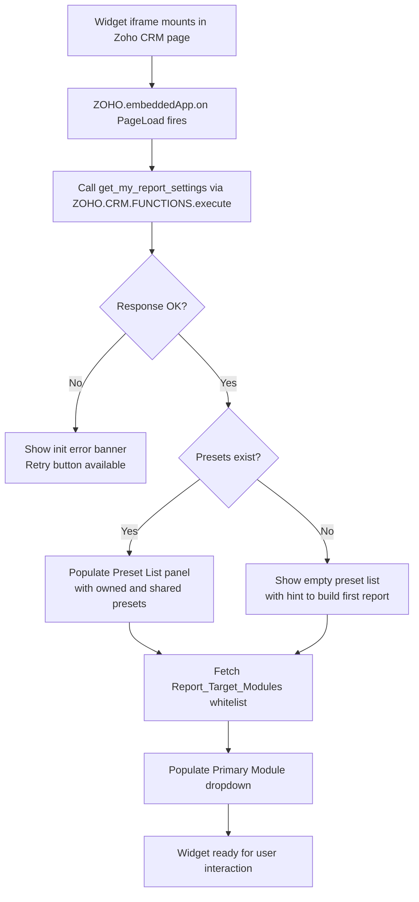
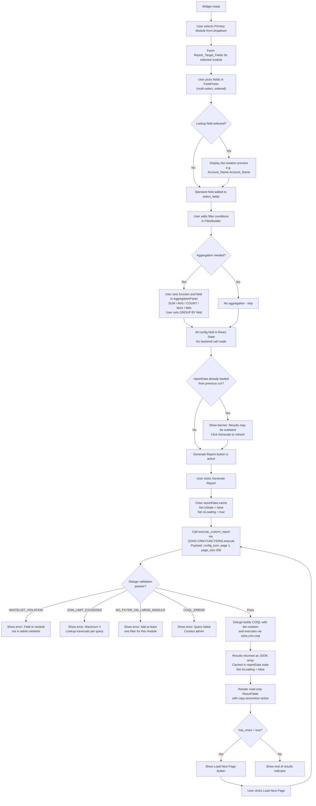
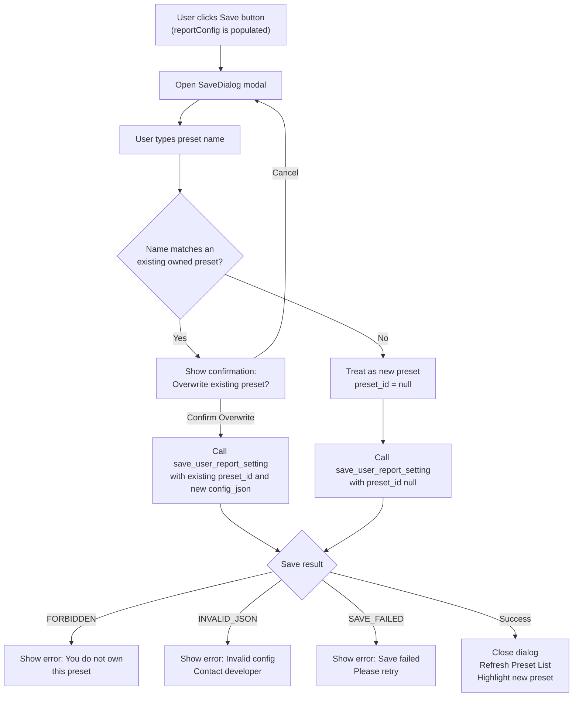
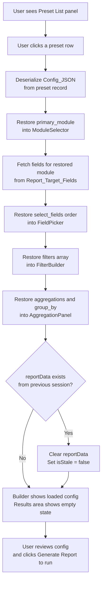
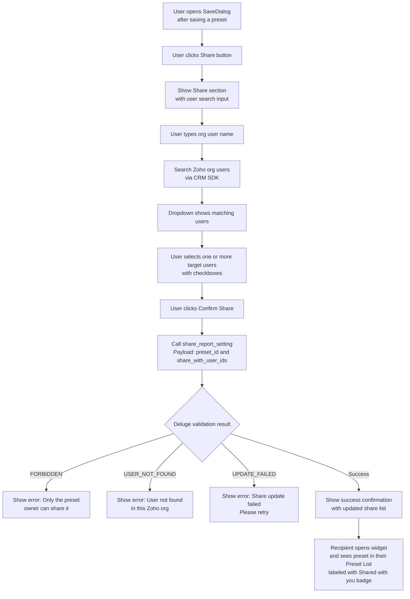
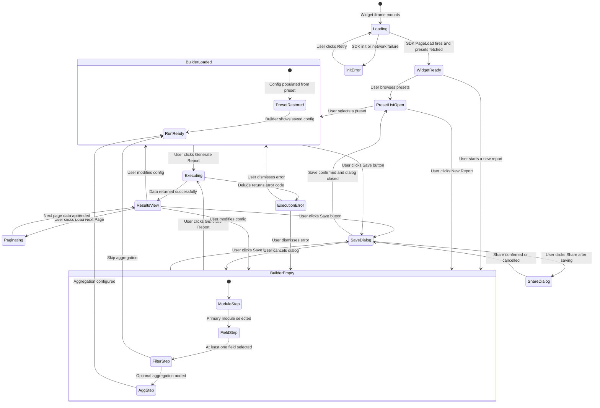
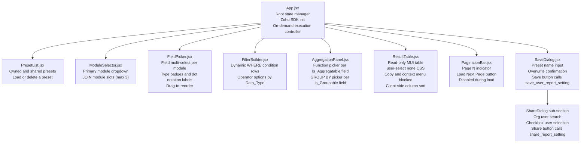

# UI Design: Zoho CRM Custom Report Widget

**Date:** 2026-06-04
**Status:** Draft
**Author:** Vivek
**LLD Reference:** `LLD_custom_report.md`
**HLD Reference:** `HLD_custom_report.md`

---

## Table of Contents

1. [Functional Flow Diagrams](#1-functional-flow-diagrams)
   - 1.1 Widget Initialization
   - 1.2 Report Building and Execution
   - 1.3 Preset Save
   - 1.4 Preset Load
   - 1.5 Preset Share
2. [Screen Transition Diagram](#2-screen-transition-diagram)
3. [UI Component Hierarchy](#3-ui-component-hierarchy)
4. [Screen Layouts (Wireframes)](#4-screen-layouts-wireframes)
   - 4.1 Main Widget — Empty State
   - 4.2 Main Widget — Builder Active
   - 4.3 Main Widget — Results View
   - 4.4 Save Dialog
   - 4.5 Share Dialog
   - 4.6 Error / Warning States

---

## 1. Functional Flow Diagrams

### 1.1 Widget Initialization Flow



---

### 1.2 Report Building and Execution Flow



---

### 1.3 Preset Save Flow



---

### 1.4 Preset Load Flow



---

### 1.5 Preset Share Flow



---

## 2. Screen Transition Diagram



---

## 3. UI Component Hierarchy



---

## 4. Screen Layouts (Wireframes)

### 4.1 Main Widget — Empty State

```
┌─────────────────────────────────────────────────────────────────────────┐
│  CRM Custom Report Builder                                     [Save ▾] │
├────────────────────┬────────────────────────────────────────────────────┤
│                    │                                                    │
│  MY PRESETS        │  BUILD YOUR REPORT                                 │
│  ─────────────     │  ─────────────────────                             │
│                    │                                                    │
│  (No presets yet)  │  Primary Module                                    │
│                    │  ┌─────────────────────────────┐                  │
│  [+ New Report]    │  │  Select a module...       ▼ │                  │
│                    │  └─────────────────────────────┘                  │
│                    │                                                    │
│                    │  [+ Add JOIN Module]                               │
│                    │                                                    │
│                    │  ─ Select a module to see available fields ─       │
│                    │                                                    │
│                    │                                                    │
│                    │  [▶ Generate Report]  ← disabled until module set  │
│                    │                                                    │
├────────────────────┴────────────────────────────────────────────────────┤
│  RESULTS                                                                │
│                                                                         │
│  Select modules and fields above, then click Generate Report.           │
│                                                                         │
└─────────────────────────────────────────────────────────────────────────┘
```

---

### 4.2 Main Widget — Builder Active (fields selected, filter added)

```
┌─────────────────────────────────────────────────────────────────────────┐
│  CRM Custom Report Builder                                     [Save ▾] │
├────────────────────┬────────────────────────────────────────────────────┤
│                    │                                                    │
│  MY PRESETS        │  BUILD YOUR REPORT                                 │
│  ─────────────     │  ─────────────────────────────────────────────     │
│                    │                                                    │
│  ● My Q1 Report    │  Primary Module          JOIN Module               │
│  ○ Sales Summary   │  ┌──────────────┐        ┌───────────────────┐    │
│  ◆ Shared: Leads   │  │  Leads     ▼ │        │  (none)         ▼ │    │
│                    │  └──────────────┘        └───────────────────┘    │
│  [+ New Report]    │  [+ Add JOIN Module]                               │
│                    │                                                    │
│                    │  FIELDS  ─────────────────────────────────────     │
│                    │  ☑ Last Name         [Text]                        │
│                    │  ☑ Annual Revenue    [Number]  [SUM eligible]      │
│                    │  ☑ ◆ Account Name   [Lookup]  → Account_Name.Account_Name │
│                    │  ☐ ◆ Account Phone  [Lookup]  → Account_Name.Phone │
│                    │  ☐ Lead Status      [PickList]                     │
│                    │                                                    │
│                    │  FILTERS  ─────────────────────────────────────    │
│                    │  [Lead Status      ▼] [=  ▼] [Open-Not Contacted] [×] │
│                    │  [+ Add Filter]                                    │
│                    │                                                    │
│                    │  AGGREGATION  ──────────────────────────────────   │
│                    │  [SUM ▼] [Annual Revenue ▼]  AS [Total_Revenue]    │
│                    │  GROUP BY: [◆ Account Name ▼]                      │
│                    │  [+ Add Aggregation]                               │
│                    │                                                    │
│                    │  [▶ Generate Report]                               │
│                    │                                                    │
├────────────────────┴────────────────────────────────────────────────────┤
│  RESULTS                                                                │
│                                                                         │
│  No results yet. Click Generate Report to run.                          │
│                                                                         │
└─────────────────────────────────────────────────────────────────────────┘
```

> Legend:  `◆` = Lookup (dot notation) field   `☑` = selected   `☐` = not selected

---

### 4.3 Main Widget — Results View

```
┌─────────────────────────────────────────────────────────────────────────┐
│  CRM Custom Report Builder                                     [Save ▾] │
├────────────────────┬────────────────────────────────────────────────────┤
│                    │                                                    │
│  MY PRESETS        │  BUILD YOUR REPORT                ▲ collapsed      │
│  ─────────────     │  [Leads]  Fields: 3  Filters: 1  [▼ Expand]       │
│                    │                                                    │
│  ● My Q1 Report    │  ⚠ Results may be outdated — click Generate to refresh │
│  ○ Sales Summary   │  (shown only when config changed after last run)   │
│  ◆ Shared: Leads   │                                                    │
│                    │  [▶ Generate Report]                               │
│  [+ New Report]    │                                                    │
├────────────────────┴────────────────────────────────────────────────────┤
│  RESULTS  —  Page 1  (200 rows per page)           Credits used: 1     │
│                                                                         │
│  ┌──────────────┬────────────────┬──────────────────┬────────────────┐  │
│  │ Last Name ↕  │ Total_Revenue  │ Account Name  ↕  │ (col 4)        │  │
│  ├──────────────┼────────────────┼──────────────────┼────────────────┤  │
│  │ Smith        │ 150,000        │ Acme Corp        │ ...            │  │
│  │ Jones        │ 220,000        │ Beta LLC         │ ...            │  │
│  │ Tanaka       │  80,000        │ Gamma Inc        │ ...            │  │
│  │ ...          │ ...            │ ...              │ ...            │  │
│  └──────────────┴────────────────┴──────────────────┴────────────────┘  │
│                                                                         │
│  Page 1  [Load Next Page →]                                             │
│  (right-click, Ctrl+C, and text selection are disabled on this table)   │
└─────────────────────────────────────────────────────────────────────────┘
```

> Column sort (`↕`) operates on cached `reportData` state — no backend call.

---

### 4.4 Save Dialog

```
                    ┌──────────────────────────────────────┐
                    │  Save Report Preset              [×] │
                    ├──────────────────────────────────────┤
                    │                                      │
                    │  Preset Name                         │
                    │  ┌──────────────────────────────┐   │
                    │  │ My Q1 Leads Report           │   │
                    │  └──────────────────────────────┘   │
                    │                                      │
                    │  ┌──────────────────────────────────┐│
                    │  │ ⚠ A preset with this name       ││
                    │  │ already exists. Overwrite?      ││
                    │  └──────────────────────────────────┘│
                    │  (shown only when name matches)      │
                    │                                      │
                    │  [Cancel]              [Save / Overwrite] │
                    └──────────────────────────────────────┘
```

---

### 4.5 Share Dialog (opened from SaveDialog after successful save)

```
                    ┌──────────────────────────────────────┐
                    │  Share Preset                    [×] │
                    ├──────────────────────────────────────┤
                    │  Preset: "My Q1 Leads Report"        │
                    │                                      │
                    │  Share with users in this org        │
                    │  ┌──────────────────────────────┐   │
                    │  │ Search by name...            │   │
                    │  └──────────────────────────────┘   │
                    │                                      │
                    │  Search results:                     │
                    │  ☐  Tanaka Hiroshi                   │
                    │  ☑  Yamamoto Keiko       ← selected  │
                    │  ☐  Suzuki Takashi                   │
                    │                                      │
                    │  Currently shared with:              │
                    │    • Yamamoto Keiko   [Remove]       │
                    │                                      │
                    │  [Cancel]              [Confirm Share]│
                    └──────────────────────────────────────┘
```

---

### 4.6 Error and Warning States

#### Validation Error Banner (below Generate Report button)

```
┌─────────────────────────────────────────────────────────────────────────┐
│  ✕ WHITELIST_VIOLATION                                              [×] │
│  Field "Custom_Unlisted_Field" is not in the allowed field list.         │
│  Contact your CRM admin to add this field to Report_Target_Fields.      │
└─────────────────────────────────────────────────────────────────────────┘
```

```
┌─────────────────────────────────────────────────────────────────────────┐
│  ✕ NO_FILTER_ON_LARGE_MODULE                                        [×] │
│  The "Leads" module has over 50,000 records. Add at least one filter    │
│  before running to avoid timeout and excess credit consumption.         │
└─────────────────────────────────────────────────────────────────────────┘
```

```
┌─────────────────────────────────────────────────────────────────────────┐
│  ✕ JOIN_LIMIT_EXCEEDED                                              [×] │
│  Maximum 3 Lookup traversals per query. Remove one Lookup field         │
│  and try again.                                                         │
└─────────────────────────────────────────────────────────────────────────┘
```

#### Stale Results Warning Banner (above result table)

```
┌─────────────────────────────────────────────────────────────────────────┐
│  ⚠ Report configuration has changed since the last run.                │
│  Click Generate Report to refresh results with current settings.        │
└─────────────────────────────────────────────────────────────────────────┘
```

#### Credit Warning Banner (inside result table footer)

```
┌─────────────────────────────────────────────────────────────────────────┐
│  ⚠ API credit usage is high for today. Avoid running additional         │
│  large queries until tomorrow's credit quota resets.                    │
└─────────────────────────────────────────────────────────────────────────┘
```

#### Loading State (during Deluge function execution)

```
┌─────────────────────────────────────────────────────────────────────────┐
│  RESULTS                                                                │
│                                                                         │
│  ████████████████████████████░░░░░░░░░░░░░░░░░░░░░░  Running query...  │
│                                                                         │
│  [▶ Generate Report]  ← disabled during execution                       │
└─────────────────────────────────────────────────────────────────────────┘
```

---

## 5. Field Type and Badge Reference

| Badge | Meaning | Eligible Operations |
|---|---|---|
| `[Text]` | Single Line or Multi-Line string field | `=`, `!=`, `contains`, `starts with` in filters |
| `[Number]` | Numeric field (currency, integer, decimal) | `=`, `!=`, `>`, `<`, `>=`, `<=`; SUM / AVG / MAX / MIN aggregation |
| `[Date]` | Date or DateTime field | `=`, `before`, `after`, `between` in filters |
| `[PickList]` | Picklist / dropdown field | `=`, `!=` in filters |
| `◆ [Lookup]` | Lookup field (dot notation traversal) | Used as JOIN key; shows dot notation label (e.g., `Account_Name.Account_Name`) |

---

## 6. Stale Banner and Cache Logic Summary

```
┌────────────────────────────────────────────────────────────────────┐
│                        REACT STATE FLOW                            │
├────────────────────────────────────────────────────────────────────┤
│                                                                    │
│  User changes any config (module / field / filter / aggregation)  │
│      → reportConfig state updated                                  │
│      → isStale = true  (if reportData is already populated)        │
│      → NO backend call                                             │
│                                                                    │
│  User clicks Generate Report                                       │
│      → reportData cleared                                          │
│      → isStale = false                                             │
│      → isLoading = true                                            │
│      → execute_custom_report called                                │
│      → result stored in reportData                                 │
│      → isLoading = false                                           │
│                                                                    │
│  User sorts a column                                               │
│      → sort applied to reportData in state                         │
│      → NO backend call                                             │
│                                                                    │
│  User clicks Load Next Page                                        │
│      → page incremented in reportConfig                            │
│      → execute_custom_report called with new page                  │
│      → result appended to reportData                               │
│                                                                    │
└────────────────────────────────────────────────────────────────────┘
```
